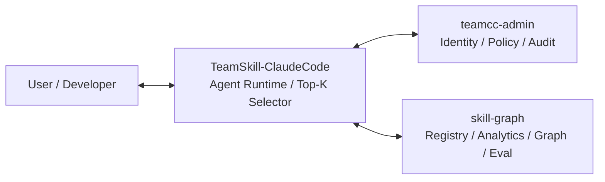

# TeamCC Platform

> An identity-aware, policy-governed, multi-skill coding agent platform for teams.

TeamCC Platform 是一个面向团队与企业场景的 Coding Agent 平台。  
它不是单纯的聊天壳，也不是单一的管理后台，而是把下面几件事打通成一套完整系统：

- 团队身份识别与细粒度权限控制
- 基于多模索引的 Skill 检索与 Top-K 选择
- Agent 运行时安全治理与权限沙箱保护
- Skill 知识图谱、持续评测与质量反馈闭环

当前仓库是一个 monorepo，包含三个核心子项目：`teamcc-admin`、`TeamSkill-ClaudeCode` 和 `skill-graph`。

## What Problem Does It Solve

同一个 Coding Agent，在不同员工、不同团队、不同项目里，不应该拥有相同的行为边界。

TeamCC 要解决的是：

- **身份感知**：让 Agent 明确知道“谁在用”，并以此作为权限与能力分发的依据。
- **安全可控**：系统决定“这个人现在能做什么”，高风险工具调用必须可审计、可回放。
- **资产治理**：让 Skill 从“个人零散的 prompt”升级为“结构化、可复用、被约束的团队资产”。
- **精准投递**：避免海量 Skill 污染上下文，只把最合适的工具投递给 AI。
- **持续进化**：基于真实选型和执行结果的数据流，评测 Skill 质量并固化到知识图谱中。

一句话说，TeamCC 要把个人开发助手升级成**团队可治理的企业级 Coding Agent Runtime**。

## Monorepo Structure & Architecture

TeamCC Platform 由三个核心项目组成，各司其职：

1. **`teamcc-admin` (身份与权限后台)**
   - 作为全平台的唯一身份源 (Single Source of Truth for Identity)。
   - 负责组织架构、用户身份、权限边界、项目策略的配置与下发。
   - 承载全局操作审计与审批流。

2. **`TeamSkill-ClaudeCode` (客户端 Runtime)**
   - 包含定制版 Claude Code 客户端。
   - 负责编译并执行严格的权限交集 (`有效权限 = 基础权限 ∩ 组织策略 ∩ 项目策略 ∩ Skill声明权限`)。
   - 执行 Skill 候选过滤、Top-K 截断与 Tool 沙箱隔离。
   - 在曝光、选择、执行、反馈各环节进行极度详细的埋点。

3. **`skill-graph` (Skill 治理、评测与知识图谱)**
   - 存储全局唯一的 `skill-registry` (Skill 事实源)。
   - 为 Runtime 提供编译后的静态投影 (Runtime Projection) 和多维度索引 (Vector, Graph, Path-Tree)。
   - 接收 Telemetry 数据，离线计算动态图谱边权与评测快照 (Score Snapshots)。
   - 提供隔离的离线评测能力 (Benchmark, Transcript Replay, Shadow Ranking)。



## Core Capabilities

### 1. Identity-Aware Runtime & Policy-First Engine

权限不再是一组散落在本地的配置或容易被绕过的指令，而是由 TeamCC Admin 集中分发、客户端强校验的策略体系。
- **规则交集**：底层引擎通过将策略编译入 Deny 名单，实现严格的逻辑交集限制。Skill 绝不能成为权限放大器。
- **审计与可观测**：对于高危操作与网络访问，必须能精确溯源到具体人员的授权动作。

### 2. Multi-Scheme Skill Retrieval

当生态内存在数千个 Skill 时，全量暴露给大体会导致模型“注意力涣散”。TeamCC 引入了多视图的召回机制：
- **向量检索 (Vector)**：基于丰富的结构化 Metadata 提取 Semantic Embedding。
- **图谱检索 (Graph)**：利用用户、项目、场景以及历史沉淀的成功使用边权 (Edge Weight) 进行关联推荐。
- **路径树检索 (Path-Tree)**：基于领域分类的稳定结构导航 (OpenViking 机制)。
各个检索路的候选集在 Unified Ranker 层进行综合评分并选取 Top-K 注入到 Agent 上下文中。

### 3. Skill Governance & Telemetry (`skill-graph`)

Skill 被严格划分为“不可篡改的事实源”和“只读的运行时投影”：
- **Registry 唯一源**：所有的规范化 Skill 存储在 `skill-graph/skill-registry`。
- **自动化流转**：通过脚本，提取合法且状态为 active 的 Skill 产出给 Runtime 使用的极简目录结构和索引，隔绝不可信的草稿。
- **数据回流**：客户端采集的曝光 (Exposed)、选中 (Selected)、调用 (Invoked) 与反馈 (Feedback) 将通过离线聚合并固化为图谱边和 Score Snapshot。

### 4. Independent Evaluation Quality System

我们坚信：“Skill 是否被调用”和“任务是否变得更好”是两码事。
- **评测分离**：专门构建用于测判（而非执行）的任务基线与评价模型（例如评测用 DeepSeek，执行用 MiniMax）。
- **多维度评测**：不只测检索召回率 (Recall@K)，更测任务实际改善度（返工率、成功耗时等）。
- **对比机制**：在 Shadow Ranking 或离线 Benchmark 中无缝对比纯规则、纯 BM25、纯 Vector 和 Hybrid 图谱检索的优劣。

## Quick Start

### Prerequisites

- Node.js 24+
- npm 11+
- Bun 1.3.5+
- Docker / Docker Compose

### 1. 启动基础数据服务 / Admin

推荐首先在主工作区 (main) 启动所有数据服务：

```bash
cd teamcc-platform/teamcc-admin
docker compose up -d postgres    # 启动 Admin DB

cd ../skill-graph
bun run skills:db:up             # 启动 Skill DB (pgvector) & Neo4j
```

后续如果需要完整本地体验 Admin 后台：

```bash
cd teamcc-admin
npm ci
npm run db:push && npm run seed
npm run dev
```

前端控制台：

```bash
cd teamcc-admin/frontend
npm ci
npm run dev -- --host 127.0.0.1
```

默认访问：
- Admin API: `http://127.0.0.1:3000`
- Admin Web: `http://127.0.0.1:5173` (Login: `admin / password123`)
- Neo4j Browser: `http://127.0.0.1:7474` (`neo4j / skills_dev_password`)

### 2. 验证与启动 TeamSkill Runtime

进入任意 worktree 中的 `TeamSkill-ClaudeCode`：

```bash
cd TeamSkill-ClaudeCode
bun install
bun run version
```

## Development Workflow

推荐使用 Git **worktree** 进行并行开发。目前存在四个主要并行开发流：
- `teamcc`：专注于 TeamSkill Runtime 的底层接入与交互改造。
- `admin`：专注于团队资产大盘、权限模板与审批流 UI。
- `skill-graph`：专注于 Skill 事实库重构、Neo4j 推荐策略演进。
- `wt-eval-runner`：专注于基于 Transcript 和 Benchmark 的专项评测工程。

> **⚠️ 关于 Docker 挂载的重要提示：**
> 如果要在不同分支（worktree）并联开发，**切忌在 worktree 内部执行由相对路径映射(`- .:/app`)的 docker-compose (除 postgres 等数据存储外)**。请务必在本地裸跑 Dev Server，或在合并到 `main` 后在主工作区统一启动容器。详细规范参考 [DEVELOPMENT.md](./DEVELOPMENT.md)。

## Key Documentation

### Platform Architecture
- [基于 Claude Code 的 Team Coding Agent 设计](./TeamSkill-ClaudeCode/docs/architecture/%E5%9F%BA%E4%BA%8Eclaudecode%E7%9A%84team%20coding%20agent%E8%AE%BE%E8%AE%A1.md)
- [基于 Claude Code 的多 Skill Coding Agent PRD](./TeamSkill-ClaudeCode/docs/architecture/%E5%9F%BA%E4%BA%8Ecc%E7%9A%84%E5%A4%9Askill%20coding%20agent%E6%9E%B6%E6%9E%84%E8%AE%BE%E8%AE%A1.md)
- [Claude Code 改造方案（最新 Runtime 接口）](./TeamSkill-ClaudeCode/docs/architecture/Claude%20Code%20%E6%94%B9%E9%80%A0%E6%96%B9%E6%A1%88.md)

### Skill Governance & Retrieval (New)
- [多检索方案兼容的 Skill 架构与迁移设计](./TeamSkill-ClaudeCode/docs/architecture/%E5%A4%9A%E6%A3%80%E7%B4%A2%E6%96%B9%E6%A1%88%E5%85%BC%E5%AE%B9%E7%9A%84Skill%E6%9E%B6%E6%9E%84%E4%B8%8E%E8%BF%81%E7%A7%BB%E8%AE%BE%E8%AE%A1.md)
- [Skill 检索与质量评测系统方案](./TeamSkill-ClaudeCode/docs/architecture/Skill%20%E6%A3%80%E7%B4%A2%E4%B8%8E%E8%B4%A8%E9%87%8F%E8%AF%84%E6%B5%8B%E7%B3%BB%E7%BB%9F%E6%96%B9%E6%A1%88.md)

### Identity & Admin Control
- [身份与权限平台化方案](./TeamSkill-ClaudeCode/docs/architecture/%E8%BA%AB%E4%BB%BD%E4%B8%8E%E6%9D%83%E9%99%90%E5%B9%B3%E5%8F%B0%E5%8C%96%E6%96%B9%E6%A1%88.md)
- [TeamCC 权限管理设计方案](./TeamSkill-ClaudeCode/docs/TEAMCC_%E8%BA%AB%E4%BB%BD%E4%B8%8E%E6%9D%83%E9%99%90%E5%88%86%E9%85%8D%E6%9E%B6%E6%9E%84%E6%96%B9%E6%A1%88.md)

## Design Principles

- **Reuse, Don’t Rebuild**: 复用并改造强化 Claude Code 优秀的 Runtime 而不是重新写一个脆弱的 Agent。
- **Strict Policy Intersection**: 绝对不把不可信的 Skill 作为逃逸本地权限体系的后门跳板。
- **Measure Instead of Guessa**: 不要盲目“塞语料”，而是利用严格的评估数据与图谱去反哺 Skill 系统的每一次迭代与截断排序。
- **Immutable Provenance**: Registry 必须作为安全唯一的单点事实存在，Runtime 只需使用它安全的切片缓存。
