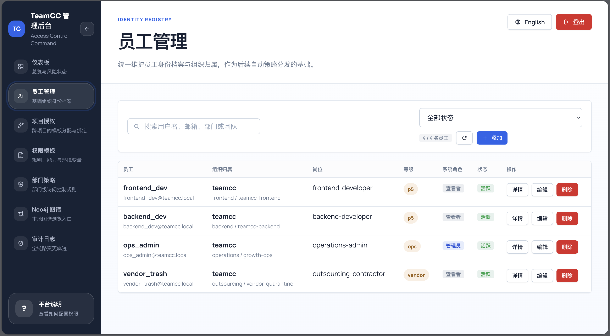
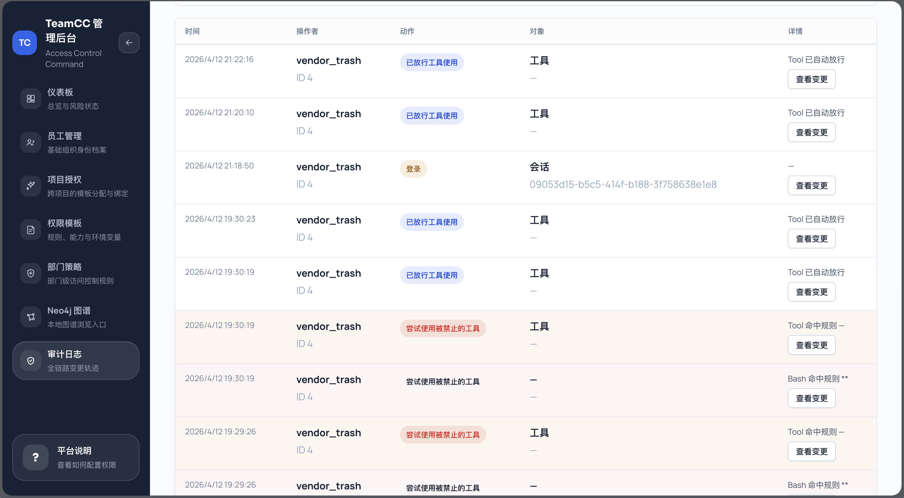
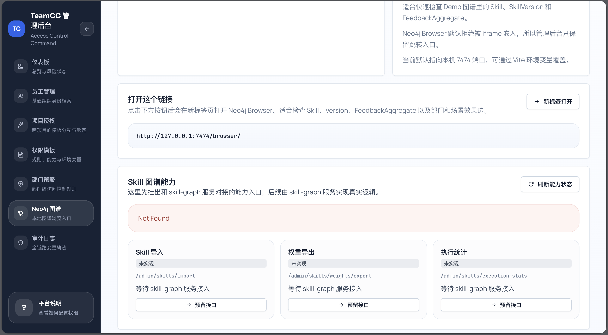
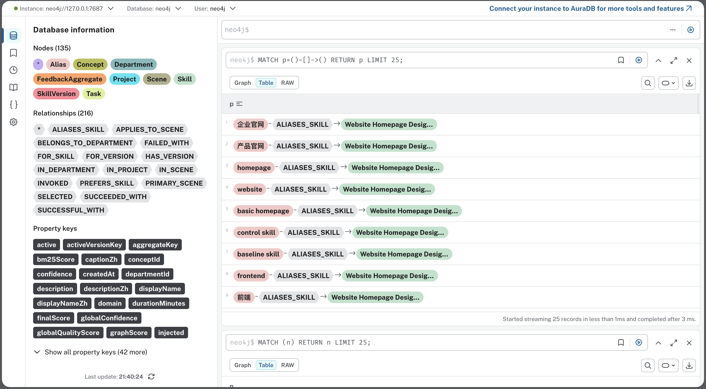
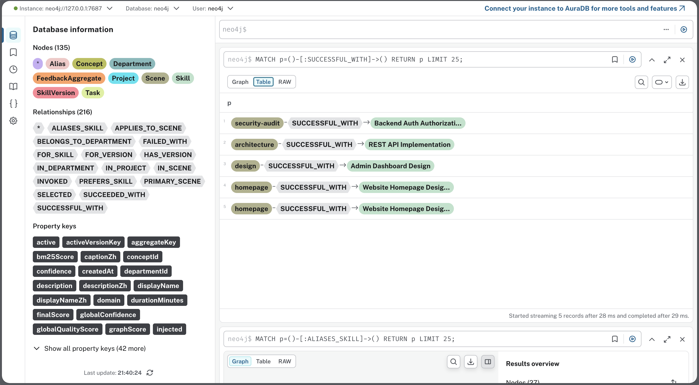

# TeamCC Platform

TeamCC 是一个围绕 Coding Agent（目前基于 Claude Code 改造）做企业级管控的项目。核心解决两个问题：

1. **员工用 Coding Agent 时，怎么管住权限？** —— 防止 Agent 越权操作、乱删文件、访问不该碰的代码。
2. **团队用 Agent 积累的经验（Skill），怎么沉淀下来复用？** —— 不让好的实践停留在个人脑子里，而是变成团队资产。

---

## 🛡️ 企业级权限管控

### 问题

把 Claude Code 直接交给团队用，最大的风险就是"过度信任"。Agent 有能力读写任意文件、执行任意命令，如果不做约束：

- 实习生可能让 Agent 改了不该改的核心模块
- Agent 可能执行破坏性的 shell 命令（`rm -rf`、`docker down` 之类）
- 不同项目组的代码和密钥没有隔离，存在横向越权

### 做法

TeamCC 的思路是：**身份 → 权限包 → 运行时拦截 → 审计**，形成闭环。

#### 1. 统一身份接入

Claude Code 启动时，先从 TeamCC Admin 拉取当前用户的身份信息（部门、角色、项目），不依赖本地手写配置文件。



```
src/bootstrap/teamccAuth.ts   → 登录、token 刷新、身份拉取
src/utils/identity.ts         → 身份数据结构化，给后续权限判断和 Skill 选择用
```

#### 2. 权限包下发与注入

管理员在 Admin 后台配置好各角色的权限策略（哪些目录可读写、哪些命令禁止执行、哪些工具需要审批），TeamCC 在运行时把这些规则注入到 Claude Code 的权限管道里。

```
src/utils/permissions/teamccLoader.ts   → 从后端拉权限包，转成运行时规则
src/utils/permissions/rulesMerger.ts    → 多来源规则按"最严格"原则合并
```

关键点：**企业规则优先级高于本地配置**。员工不能通过修改本地 `.claude/` 配置文件绕过企业策略。deny 规则绝对优先。

#### 3. 运行时拦截

当 Agent 要执行某个操作时（写文件、跑命令、调工具），权限引擎实时判断：

- **allow**：直接放行
- **deny**：立即阻断，Agent 无法执行
- **ask**：弹出审批，需要上级确认

#### 4. 全链路审计

每次操作都会以 fire-and-forget 方式上报到 Admin 后台，记录：谁、什么身份、做了什么、结果如何。

```
src/bootstrap/teamccAudit.ts  → 审计上报（boot / bash_command / file_write / tool_permission_decision）
```

Admin 后台提供审计日志查询，以及基于 Neo4j 的权限拓扑可视化（人 → 角色 → 可操作资源的关系图）。





---

## 🧠 Skill 沉淀体系

个人用 Agent 的痛点是每次都要重新教；团队的痛点是好的经验出不了个人目录。TeamCC 把 Skill 从散落的文件变成可检索、可评价、可流转的团队资产。



- **知识图谱驱动的精准治理**：底层用 Neo4j 构建 **部门 → 场景 → Skill → 调用记录** 的完整知识图谱。每次 Skill 调用都会记录成功/失败结果，系统据此统计每个 Skill 在不同部门、不同场景下的成功率、失败率和综合得分，让 Skill 的质量、适用范围一目了然。管理者可以直观看到"哪个部门在哪个场景用了哪个 Skill，效果怎么样"。


- **版本化管理 + 权重动态调整**：每个 Skill 支持版本迭代（v1 → v2 → v3...）。新版本上线后不会立即替换旧版，而是通过 AB 权重分配逐步放量——新版本初始权重低，随着调用数据积累，系统自动调整权重。表现好的版本权重上升成为主力，表现差的自动降权淘汰。
- **海量 Skill + SaaS 化外放**：架构设计面向 **海量 Skill 规模**（pgvector 向量检索 + BM25 混合召回），支持千级甚至万级 Skill 的毫秒级检索。同时可以作为 **SaaS 平台**，将企业内部沉淀并验证过的高质量 Skill 对外开放给其他团队或企业使用。平台天然具备 **网络效应**：用的人越多 → 调用数据越多 → 排序模型越准 → Skill 匹配效果越好。
- **异步图谱更新 + 定时统计**：Skill 调用产生的事件（`skill_invoked` / `skill_completed` / `skill_feedback`）通过 **异步消息** 回写到知识图谱，不阻塞 Agent 主流程。后台 **定时任务** 周期性地对图谱中的调用数据进行聚合统计，重新计算各 Skill 的综合得分和排序权重，保证数据最终一致的同时不影响运行时性能。

---

## 本地开发

详细的启动步骤、分支规范、Docker 用法见 [DEVELOPMENT.md](./DEVELOPMENT.md)。

快速概览：

```bash
# 一键启动全部服务（Admin 平台、数据库、图数据库等）
./scripts/platform.sh start

# 初始化 Skill 知识图谱数据（Admin 数据已随容器自动初始化）
cd skill-graph && bun install && bun run skills:graph:seed-v1

# 本地运行与验证 TeamSkill CLI
cd TeamSkill-ClaudeCode
bun run version  # 检查版本
bun run dev      # 在当前目录启动 CLI

# 💡 建议将 teamcc 注册为全局系统命令
# 请在你的 shell 配置文件（如 ~/.zshrc 或 ~/.bash_profile）中添加别名：
# alias teamcc='bun --env-file=/全路径/teamcc-platform/TeamSkill-ClaudeCode/.env run /全路径/teamcc-platform/TeamSkill-ClaudeCode/src/bootstrap-entry.ts'
# 保存后执行 `source ~/.zshrc`，即可在任何目录下使用 `teamcc` 命令了！
```

---

## 技术栈

| 层 | 技术 |
|---|---|
| Coding Agent 内核 | Claude Code（TypeScript，深度改造） |
| Admin 后端 | Node.js + Hono + Drizzle ORM |
| Admin 前端 | React + Vite |
| 关系型数据库 | PostgreSQL |
| 向量检索 | pgvector |
| 图数据库 | Neo4j |
| 运行时 | Bun / Node.js |
| 容器 | Docker Compose |
