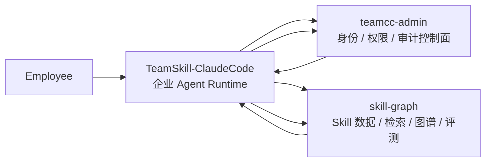

# TeamCC Platform

> 一个基于 Claude Code 深度改造的企业级 Coding Agent 平台。

TeamCC Platform 的核心目标不是“做一个新的聊天壳”，而是把 Claude Code 改造成一个**可识别员工身份、可执行企业权限策略、可审计、可治理**的团队级 Agent Runtime。

这套系统当前围绕两条主线展开：

- **企业身份注入**：让运行中的 Agent 明确知道当前操作者是谁、属于哪个部门、默认项目是什么、当前处于什么权限态。
- **权限控制收口**：通过管理平台下发身份与项目权限包，把工具调用、文件修改、命令执行和高风险能力统一纳入可控边界。

换句话说，TeamCC 做的不是“给 Claude Code 加一个登录页”，而是**把 Claude Code 的运行时改造成企业员工上下文驱动的安全执行环境**。

## 我们到底改造了什么

当前项目最重要的改造点有四个：

### 1. 把 Claude Code 从“本地用户代理”改造成“企业员工运行时”

在原始 Claude Code 里，模型看到的主要是当前仓库和当前会话上下文。
TeamCC 的改造目标是让运行时额外具备“员工身份面”：

- 当前登录员工是谁
- 员工属于哪个部门、团队、角色、级别
- 当前默认项目和当前项目权限边界是什么
- 这轮会话是否已经通过企业鉴权

这些信息不再来自本地手写文档，也不再依赖历史的 `.claude/identity/active.md`。
当前实现中，**企业身份唯一真相源是管理平台返回的 `/identity/me`**，客户端只消费远端验证后的 `IdentityEnvelope`。

### 2. 把权限判断从“本地配置偏好”升级为“管理平台控制面”

TeamCC 不把权限看作本地提示词或少量 allowlist，而是把它设计成真正的控制面：

- `teamcc-admin` 负责登录、身份、权限模板、项目授权、审计查询
- `TeamSkill-ClaudeCode` 负责启动鉴权、运行时注入、工具执行边界控制
- 权限包由 `/policy/bundle` 返回，客户端编译到 `ToolPermissionContext`

当前规则模型遵循：

```text
deny > ask > allow
```

也就是说，企业权限不是“建议”，而是实际进入工具判定链路的硬约束。

### 3. 把登录态变成启动期和运行时的第一门禁

现在这套运行时已经不是“先启动，再看要不要登录”，而是：

- 普通启动时，先建立 TeamCC 企业会话
- 未认证状态下，不允许进入完整企业运行态
- 只保留 `/login`、`/auth`、`/logout` 这类认证相关入口
- 登录成功后热更新当前 runtime，不要求重启
- 登录取消或失败不会再偷偷落回普通 REPL

这意味着 TeamCC 已经把 Claude Code 的启动流程改造成**身份前置**的企业入口。

### 4. 把员工身份继续传导到 Skill 检索、审计和反馈链路

员工身份不只是为了显示“你是谁”，还会继续影响：

- Skill 检索时的 `department` hint
- Prompt / Context 里的企业态说明
- Tool 级安全审计
- Skill exposure / selection / invocation 归因
- 图谱事实与离线评测沉淀

也就是说，身份不只是登录结果，而是整个 Agent 运行链路的基础上下文。

## 当前仓库的三层结构

虽然这个项目的主轴是“深改 Claude Code”，但当前代码库不是单一客户端，而是一套分层协作系统：

| 目录 | 当前角色 | 主要职责 |
| --- | --- | --- |
| `TeamSkill-ClaudeCode/` | 企业运行时 | 深改 Claude Code、注入身份、执行权限判定、工具审计、Skill 注入与调用 |
| `teamcc-admin/` | 管理平台 | 登录、身份查询、权限模板、项目授权、审计后台 |
| `skill-graph/` | Skill 数据与检索 owner | Skill registry、embeddings、retrieval、事实事件、聚合、图谱更新、评测 |

可以把它理解为：



其中，真正被深改的核心是 `TeamSkill-ClaudeCode/`，另外两个项目分别作为：

- **控制面**：身份、权限、审计的权威来源
- **数据面**：Skill 治理、检索、评测、图谱的权威来源

## 企业身份与权限是如何进入 Claude Code Runtime 的

这条链路是整个项目最关键的设计。

### Step 1. 启动时先建立 TeamCC 会话

运行时启动后，会优先读取 TeamCC 配置：

- 项目级 `.teamcc/config.json`
- 用户级 `~/.teamcc/config.json`
- 环境变量 `TEAMCC_ADMIN_URL` / `TEAMCC_ACCESS_TOKEN` / `TEAMCC_REFRESH_TOKEN`

然后走统一 bootstrap：

1. 校验是否存在有效 TeamCC 配置
2. 通过 access token 调用 `/identity/me`
3. 拿到远端验证后的身份信息并生成 `IdentityProfile`
4. 继续调用 `/policy/bundle`
5. 把权限规则编译进 `ToolPermissionContext`

当前运行时会得到三种状态之一：

- `unauthenticated`
- `authenticated_scoped`
- `authenticated_restricted`

其中：

- `authenticated_scoped`：身份和权限包都拿到了，进入完整企业运行态
- `authenticated_restricted`：身份已确认，但权限包拉取失败，进入 restricted mode

### Step 2. 身份只认远端，不再认本地票据

当前项目已经明确取消旧方案：

- 不再使用 `.claude/identity/active.md`
- 不再把本地身份缓存视为企业真相源
- `IdentityProfile` 的语义变成“已通过 TeamCC 远端验证的身份摘要”

缓存现在只承担：

- 登录后留痕
- 联调调试
- 某些退出场景的补充审计

它不再承担“本地身份恢复即为真相”的职责。

### Step 3. 权限包真正进入工具判定链路

TeamCC 不是只把权限下载下来存在本地，而是把它送进运行时权限系统。

当前权限注入逻辑会把 TeamCC bundle 编译为 `PermissionRule`，并写入：

- `alwaysAllowRules`
- `alwaysDenyRules`
- `alwaysAskRules`

在 `authenticated_restricted` 下，运行时会进入 fail-closed 的受限模式，默认拒绝高风险能力，包括：

- `Bash`
- `PowerShell`
- `Edit`
- `Write`
- `NotebookEdit`
- `Agent`
- `RemoteTrigger`

这意味着：**身份确认但权限包失败时，系统不会“先放开再说”，而是默认收紧。**

### Step 4. 登录 / 登出会热更新当前 runtime

`/login` 不再只是写 token 文件，而是会立刻：

- 获取 `/identity/me`
- 重建 TeamCC session
- 重建 `toolPermissionContext`
- 更新当前会话的身份和权限状态

`/logout` 会同步清掉：

- runtime identity
- TeamCC session state
- TeamCC 注入的权限规则

所以 TeamCC 已经把 Claude Code 的认证流程做成了**运行时热更新的一部分**。

## 管理平台在这套系统里扮演什么角色

`teamcc-admin/` 不是一个孤立后台，而是这套企业 Agent 的控制面。

### 当前控制面能力

- 用户登录：`POST /auth/login`
- token 刷新：`POST /auth/refresh`
- 当前身份：`GET /identity/me`
- 项目权限包：`GET /policy/bundle?projectId=<n>`
- 审计上报：`POST /api/audit`
- 审计查询：`GET /api/audit/logs`

### 当前权限模型

管理平台侧的权限合成是按 **用户 + 项目** 结算的。

输入包括：

- 用户身份信息
- 部门策略 `department_policies`
- 权限模板 `permission_templates`
- 项目授权 `user_assignments`

输出是：

- `IdentityEnvelope`
- `PermissionBundle`

当前 bundle 中主要包含：

- `rules`
- `capabilities`
- `envOverrides`

这层设计的意义是：
**客户端不自己发明企业权限，而是消费控制面计算好的结果。**

## Skill 体系和企业身份的关系

这个仓库不只是做权限系统，也在做 Skill 治理。
但 Skill 体系不是独立于身份和权限之外的“另一套系统”。

### 当前 Skill 检索 owner

当前主路径已经收口到：

- `skill-graph/` 负责 retrieval owner
- `TeamSkill-ClaudeCode/` 只保留 runtime adapter

也就是说，现在不是客户端自己做一套独立检索，而是：

1. `TeamSkill-ClaudeCode/src/services/skillSearch/provider.ts` 收集运行时上下文
2. 把上下文转换成 `SkillRetrievalRequest`
3. 调用 `@teamcc/skill-graph/retrieval.retrieveSkills()`
4. 消费统一返回的 `SkillRetrievalResponse`

### 员工身份如何影响 Skill

当前 identity 已经会进入 Skill 检索链路，至少影响：

- `department` hint
- 当前项目上下文
- 当前 query 的 scene / domain 提示
- 暴露、选中、调用的 telemetry 归因

所以 TeamCC 的目标不是“先做权限，后做 Skill”，而是：

- 用身份决定 Skill 可见性与推荐范围
- 用权限决定 Skill 执行边界
- 用使用数据再反哺 Skill 图谱和评测

## 审计不是附属能力，而是主链路的一部分

TeamCC 当前已经把安全审计接入到多个关键点：

- 启动
- 登录 / 登出
- 退出
- Bash 执行
- 文件写入
- 权限放行 / 拒绝 / 询问

这部分的意义不是“记录一下日志”，而是要实现：

- 谁在用
- 用了什么能力
- 是按什么权限规则放行的
- 当前是否处于企业身份态 / restricted mode

从设计上讲，这使得 Claude Code 从“本地代理工具”升级成了**企业可追责运行时**。

## 当前项目结构

```text
.
├── README.md
├── DEVELOPMENT.md
├── WORKTREE_NOTICE.md
├── TeamSkill-ClaudeCode/
│   ├── src/
│   │   ├── bootstrap/
│   │   ├── commands/
│   │   ├── tools/
│   │   ├── screens/
│   │   └── services/skillSearch/
│   ├── docs/
│   └── evals/
├── teamcc-admin/
│   ├── src/
│   │   ├── api/
│   │   ├── services/
│   │   ├── db/
│   │   └── types/
│   └── frontend/
├── skill-graph/
│   ├── src/
│   │   ├── retrieval/
│   │   ├── events/
│   │   ├── aggregates/
│   │   ├── graph/
│   │   └── registry/
│   ├── skills-flat/
│   ├── data/
│   ├── evals/
│   └── docs/
└── scripts/
```

## 本地启动方式

> 当前推荐按子项目分别启动。
> 如果你使用 git worktree 做开发，容器和主工作区联调规范请先阅读 [DEVELOPMENT.md](./DEVELOPMENT.md)。

### 环境要求

- Node.js 24+（`TeamSkill-ClaudeCode`）
- Node.js 20+（`teamcc-admin`）
- npm 11+
- Bun 1.3.5+
- Docker / Docker Compose

### 1. 启动 TeamCC Admin 数据库

```bash
cd teamcc-admin
docker compose up -d postgres
```

### 2. 初始化 TeamCC Admin

```bash
cd teamcc-admin
npm install
npm run db:push
npm run seed
npm run dev
```

如果还需要前端控制台：

```bash
cd teamcc-admin/frontend
npm install
npm run dev -- --host 127.0.0.1
```

默认地址：

- API: `http://127.0.0.1:3000`
- Web: `http://127.0.0.1:5173`

### 3. 启动 Skill 数据服务

```bash
cd skill-graph
bun install
bun run skills:db:up
```

会启动：

- pgvector / Postgres
- Neo4j

### 4. 启动企业版 Claude Code Runtime

```bash
cd TeamSkill-ClaudeCode
bun install
bun run dev
```

启动后优先完成：

```text
/login
/auth status
/identity
/permissions
```

如果你要验证 Skill 检索：

```text
/skills search 前端登录页
```

## 常用开发命令

### TeamSkill-ClaudeCode

```bash
cd TeamSkill-ClaudeCode
bun run dev
bun run version
```

### teamcc-admin

```bash
cd teamcc-admin
npm run dev
npm run db:push
npm run seed
npm run typecheck
```

### skill-graph

```bash
cd skill-graph
bun run skills:normalize-registry
bun run skills:build-embeddings
bun run skills:facts:aggregate
bun run skills:graph:seed-v1
bun run eval:skills
```

## 当前状态与边界

这是理解本项目时最需要注意的部分。

### 1. 当前主轴是“企业运行时”，不是通用开源 CLI 包装

`TeamSkill-ClaudeCode/` 虽然源自 Claude Code 运行时，但当前已经被深改为企业执行环境。
重点不是保留原貌，而是：

- 接 TeamCC 身份
- 接 TeamCC 权限
- 把权限送进实际工具链
- 让运行时对员工、项目、权限态有感知

### 2. 正常交互启动已经默认要求 TeamCC 身份

当前实现中，普通启动默认需要 TeamCC 会话。
未认证状态下，只允许认证相关入口继续运行，不允许普通输入直接进入完整 REPL 主链路。

### 3. `.teamcc` 是正式目录协议，`.claude` 仍有历史残留

目前仓库仍处于迁移期：

- 新的 TeamCC 配置和运行态目录以 `.teamcc` 为准
- `.claude` 主要作为历史兼容来源
- 文档与部分路径仍在清理收口中

### 4. `skill-graph` 已经是 retrieval owner，但还不是独立在线服务

当前 `skill-graph/` 既是数据目录，也是本地包：

- 它已经持有检索 API owner
- 也持有 graph facts / aggregates / eval
- 但当前主路径还是 repo 内 package export，不是远端 graph API 服务

### 5. 审计、评测、图谱都已接入，但仍在持续收口

这套系统已经不是 PoC：

- 身份链路已接入
- 权限链路已接入
- Skill 检索已接入
- 审计埋点已接入

但也仍处于持续演进中，尤其是：

- 更完整的图谱特征在线使用
- 更细粒度的权限诊断可见性
- `.claude -> .teamcc` 的目录协议彻底收口

## 重点文档

如果你要继续开发，建议从下面几份文档开始：

- [TeamCC 集成状态](./TeamSkill-ClaudeCode/docs/TEAMCC_INTEGRATION_STATUS.md)
- [TeamCC Admin 集成方案](./TeamSkill-ClaudeCode/docs/architecture/20260411-teamcc-admin-integration.md)
- [权限规则规范](./teamcc-admin/docs/TEAMCC_权限规则规范.md)
- [Skill 检索、注入与重排序方案](./TeamSkill-ClaudeCode/docs/architecture/20260411-skill-retrieval-injection-rerank.md)
- [Skill Graph 接手文档](./skill-graph/docs/architecture/20260412-skill-graph-handover.md)
- [目录协议统一规范](./skill-graph/docs/architecture/20260412-teamcc-directory-governance.md)
- [开发工作流说明](./DEVELOPMENT.md)

## 一句话总结

TeamCC Platform 的本质不是“给 Claude Code 增加几个企业命令”，而是：

**深度改造 Claude Code Runtime，让 Agent 在运行时携带企业员工身份，并通过管理平台持续下发、执行和审计员工权限边界。**

Skill 检索、图谱、反馈和评测，都是建立在这套企业身份与权限控制面之上的第二层能力。
