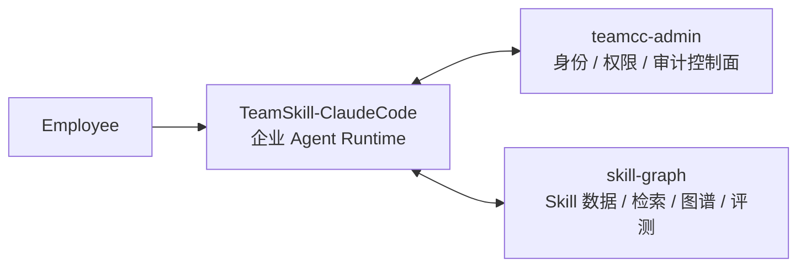

# TeamCC Platform

> 面向团队协作的企业级 Coding Agent 平台。基于 Claude Code 深度改造，核心解决 **员工使用 AI Agent 的权限管控** 与 **团队 Skill 资产沉淀** 两个关键问题。

---

## 项目目的

把 Claude Code 这类强大但"过度信任"的 Coding Agent，改造成企业可以放心交给团队用的工具：

1. **权限管控**：防止 Agent 越权操作、执行破坏性命令、访问不该碰的代码。每次工具调用都走统一的身份 + 权限判定链路，可放行、可拦截、可审计。
2. **Skill 沉淀**：团队成员用 Agent 积累的经验不再停留在个人目录，而是变成可检索、可评价、可流转的团队资产。底层用知识图谱记录"部门 → 场景 → Skill → 调用结果"，用数据反哺 Skill 推荐和质量评价。

---

## 已实现成果

当前仓库已不是 PoC，而是一套运行中的三层协作系统。关键数据：

| 维度 | 指标 |
|------|------|
| Claude Code 运行时改造 | **2000+ TS/TSX 源文件**，覆盖启动鉴权、权限注入、工具拦截、审计埋点 |
| Skill 知识图谱 | **109 个 Skill** 已入库，支持向量 + BM25 混合检索 |
| 企业管控接口 | **4 组核心 API**（`auth` / `identity` / `policy` / `audit`），完整覆盖登录 → 权限下发 → 审计上报链路 |
| 文档体系 | **140+ 架构/参考/运维文档**，已按类型分类归档 |

### 核心能力落地情况

- ✅ **企业身份注入**：启动即鉴权，身份唯一真相源是管理平台 `/identity/me`
- ✅ **权限控制面**：`deny > ask > allow` 规则编译进 `ToolPermissionContext`，fail-closed 受限模式
- ✅ **全链路审计**：启动 / 登录 / Bash / 文件写入 / 权限决策全部上报 `teamcc-admin`
- ✅ **Skill 检索收口**：`skill-graph` 作为统一 retrieval owner，支持身份驱动的部门/场景 hint
- ✅ **图谱驱动评分**：Skill 调用反馈异步回写 Neo4j，定时聚合为重排权重

### Skill 检索评测（最新：`graph-preference` 专项 500 条）

Skill 检索不是"拍脑袋上线"，而是每次变更都过一遍离线评测基准。最新一轮把图谱偏好专项集从 308 条扩到 **500 条**，审计 `issueCount = 0`，正式 run 未降级。

**整体检索质量（500 cases，Top3 Acceptable Hit ≥ 96.8%）：**

| 模式 | Recall@1 | Recall@3 | Recall@5 | MRR | Top3 Acceptable |
|------|---------:|---------:|---------:|----:|----------------:|
| `bm25` | 0.706 | 0.950 | 0.976 | 0.826 | 0.968 |
| `bm25_vector` | **0.712** | **0.958** | **0.978** | **0.832** | **0.972** |

**按业务域分布的 Recall@1（500 cases）：**

| domain | caseCount | bm25 R@1 | bm25+vector R@1 |
|--------|----------:|---------:|----------------:|
| `backend` | 60 | **1.000** | **1.000** |
| `security` | 60 | 0.983 | 0.983 |
| `ai` | 20 | 0.850 | 0.900 |
| `tools` | 54 | 0.778 | 0.796 |
| `review` | 27 | 0.741 | 0.741 |
| `general` | 19 | 0.684 | 0.632 |
| `design` | 60 | 0.667 | 0.667 |
| `frontend` | 200 | 0.510 | 0.520 |

**Homepage 偏好子集**：20 条中 **19 条** 将高质量 `-pro` 版本顶上 Top1。

> 图谱 rerank 链路（`bm25_vector_graph`）已接入但本轮因路径回落未真正参与，下一步工作重点在修复图谱 apply 路径后重跑 500 条专项集做 uplift 验收。详见 [graph-preference 500 cases 评测总结](./skill-graph/evals/skills/reports/20260415-graph-preference-v2-500cases-summary.md)。

### 界面预览


*管理后台：员工与身份管理*


*管理后台：全链路审计日志*


*管理后台：基于 Neo4j 的权限拓扑可视化*


*Skill 知识图谱：部门 → 场景 → Skill → 调用记录*

---

## 项目结构

本仓库是 monorepo，由三个协作子项目组成：



### 🛠️ [`TeamSkill-ClaudeCode/`](./TeamSkill-ClaudeCode/) — 企业 Agent Runtime

基于 Claude Code 深度改造的运行时核心。负责：

- 启动期鉴权与会话建立
- 企业身份与权限规则注入工具链
- Skill 检索适配与 runtime 执行
- 全链路审计事件埋点与上报

**→ [详细文档](./TeamSkill-ClaudeCode/README.md)**

### 🔐 [`teamcc-admin/`](./teamcc-admin/) — 管理控制面

`Fastify + TypeScript + Drizzle ORM + PostgreSQL` + `React 19` 前端。负责：

- 员工身份档案与部门策略
- 权限模板与项目授权
- 用户在项目下的最终权限预览
- Claude Code 审计事件的接收与查询

**→ [详细文档](./teamcc-admin/README.md)**

### 📊 [`skill-graph/`](./skill-graph/) — Skill 数据与检索

Skill 的数据面与检索 owner。负责：

- Skill registry 与 embeddings 管理
- 统一检索 API（lexical + BM25 + 向量）
- 调用反馈事件的异步图谱回写
- 评测基准与离线评测 runner

**→ [详细文档](./skill-graph/README.md)**

---

## 快速开始

详细启动步骤、分支规范、Docker 用法见 [DEVELOPMENT.md](./DEVELOPMENT.md)。

快速概览：

```bash
# 1. 一键启动全部服务（Admin 平台、数据库、图数据库等）
./scripts/platform.sh start

# 2. 初始化 Skill 知识图谱数据
cd skill-graph && bun install && bun run skills:graph:seed-v1

# 3. 启动企业版 Claude Code CLI
cd TeamSkill-ClaudeCode && bun install && bun run dev
```

启动后在 CLI 中完成 `/login` 即可进入企业运行态。

---

## 技术栈

| 层 | 技术 |
|---|---|
| Agent 运行时 | Claude Code（TypeScript，深度改造）+ Bun |
| Admin 后端 | Node.js + Fastify + Drizzle ORM |
| Admin 前端 | React 19 + Vite + i18next |
| 关系型数据库 | PostgreSQL |
| 向量检索 | pgvector |
| 图数据库 | Neo4j |
| 容器编排 | Docker Compose |

---

## 平台级文档

- [开发工作流](./DEVELOPMENT.md) — 启动、分支、Docker、worktree 规范
- [Worktree 协作说明](./WORKTREE_NOTICE.md)
- 子项目详细文档：[TeamSkill-ClaudeCode](./TeamSkill-ClaudeCode/README.md) · [teamcc-admin](./teamcc-admin/README.md) · [skill-graph](./skill-graph/README.md)

---

## 一句话总结

TeamCC Platform 的本质不是"给 Claude Code 增加几个企业命令"，而是：

**把 Claude Code 的运行时改造成企业员工上下文驱动的安全执行环境，并围绕它搭建起 Skill 治理、权限控制、全链路审计的完整闭环。**
