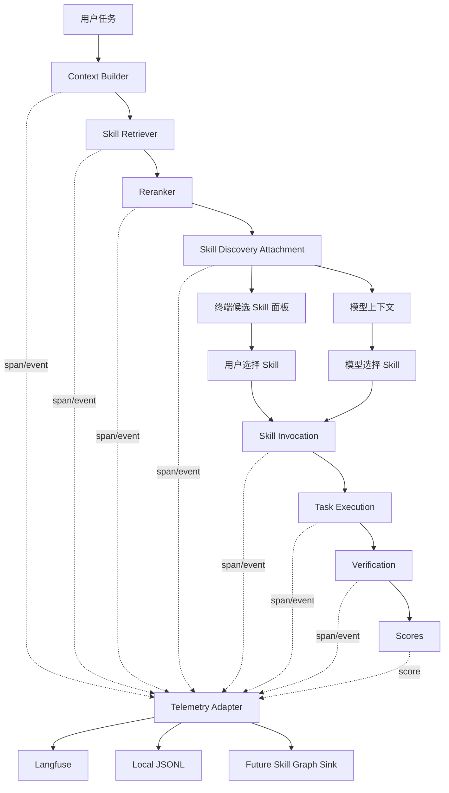

# Skill 从零检索到任务完成的评测与观测系统设计

## 1. 文档目标

本文档定义一套面向当前项目的 Skill 评测与观测系统，用于评估“从 0 开始检索 Skill、选择 Skill、使用 Skill、完成任务”的完整链路。

这里的“从 0”指：

- 不预先告诉模型应该使用哪个 Skill。
- 不手动把目标 Skill 全文塞进上下文。
- 只给系统用户任务、项目上下文、部门和场景等真实输入信号。
- 由系统完成检索、排序、展示、选择、注入、调用和任务执行。

本文档重点回答：

- 评测系统选型用什么。
- 每次任务需要采集哪些事件。
- Langfuse、OpenTelemetry、本地图谱数据库分别承担什么职责。
- 如何设计离线评测、在线观测、人工反馈和版本对比。
- 如何把评测结果沉淀为“部门-场景-Skill”的知识图谱效果数据。

## 2. 结论摘要

当前阶段建议采用：

```text
Langfuse 作为主评测与观测平台
+ OpenTelemetry 风格事件 schema 作为埋点标准
+ 项目内自研 skill-eval runner 作为执行器
+ 本地 JSONL 作为可回放备份
+ 后续图谱数据库作为长期效果沉淀层
```

不建议只用 OpenTelemetry 或“tele”：

- OpenTelemetry 适合做标准化 trace/span/event。
- OpenTelemetry 不负责 LLM dataset、人工标注、LLM-as-a-Judge、实验对比和评测报表。
- 所以它更适合作为底层协议，而不是完整评测系统。

不建议一开始直接只做图谱数据库：

- 图谱适合沉淀长期关系和效果。
- 但图谱不适合直接承载调试期的大量 trace、prompt、候选列表、模型输出、人工标注和实验对比。
- 图谱应该消费评测系统产出的结构化结果，而不是替代评测系统。

Langfuse 在当前阶段最合适：

- 支持 trace、span、generation、score。
- 支持 dataset 和 experiment。
- 支持人工评分和 LLM-as-a-Judge。
- 支持自托管。
- 可通过 OpenTelemetry 集成，后续迁移到 Phoenix 或接入 OTel Collector 的成本较低。

## 3. 设计原则

### 3.1 Runtime 与评测解耦

Skill runtime 只负责真实执行：

- 检索候选 Skill。
- 给模型注入候选 Skill。
- 展示候选 Skill。
- 处理模型或用户的 Skill 选择。
- 加载并调用 Skill。

评测系统负责观察和打分：

- 记录每个检索阶段的输入和输出。
- 记录 Skill 是否被选中、注入和调用。
- 记录任务执行结果。
- 记录人工反馈和自动评分。
- 形成版本对比。

runtime 不应该依赖 Langfuse 才能工作。Langfuse 失败时，runtime 应降级为只写本地 JSONL 或完全不写观测数据。

### 3.2 先 schema，后平台

所有事件先按照项目自定义 schema 设计，然后映射到 Langfuse 或 OpenTelemetry。

这样做的原因：

- Langfuse、Phoenix、Braintrust 或自研图谱都可以消费同一份事件。
- 后续平台切换时，业务含义不变。
- 评测指标和图谱沉淀不会被某个 SaaS 的字段命名绑定。

### 3.3 评测对象必须可版本化

以下对象必须记录版本：

- Skill registry 版本。
- Skill metadata schema 版本。
- 单个 Skill 的 `version`。
- 单个 Skill 的 `sourceHash`。
- 检索器版本。
- 重排序器版本。
- eval runner 版本。
- 模型版本。
- 评测 case 版本。

否则无法回答：

```text
到底是 Skill 内容变好了，还是检索器变好了，还是模型变了？
```

### 3.4 评测指标分层

不能只用一个综合分。Skill 链路至少需要四层指标：

- 检索指标：有没有找对。
- 选择指标：有没有选对。
- 使用指标：有没有真的调用和遵循。
- 任务指标：最终有没有做好。

综合分只适合看趋势，不适合作为问题定位依据。

## 4. 系统边界

### 4.1 当前项目已有能力

当前项目已经具备 Skill 检索与注入的初始链路：

- `src/services/skillSearch/localSearch.ts`
- `src/services/skillSearch/prefetch.ts`
- `src/services/skillSearch/registry.ts`
- `src/components/InjectedSkillsPanel.tsx`
- `src/utils/attachments.ts`
- `src/utils/messages.ts`
- `src/skills/loadSkillsDir.ts`

这些模块已经能够支持：

- 从 `skills-flat/` 建立本地检索索引。
- 读取部门、场景、domain 等 Skill 元信息。
- 在 turn-0 和 inter-turn 阶段检索候选 Skill。
- 通过 `skill_discovery` attachment 向模型暴露候选 Skill。
- 在终端 UI 中显示当前发现或调用的 Skill。
- 将 registry 中的 Skill 加入 runtime 可调用范围。

### 4.2 当前缺口

当前还缺：

- 统一事件 schema。
- Skill 检索和使用过程的 trace。
- Langfuse 接入。
- eval runner。
- 标准化 eval case。
- Recall@k、MRR、nDCG 等离线指标计算。
- task success、build pass、human score 等任务指标采集。
- 长期图谱沉淀接口。

### 4.3 本方案不解决的问题

本方案不直接实现：

- 图谱数据库选型和完整 schema。
- 复杂向量检索平台。
- 多租户权限和脱敏网关。
- 企业级报表系统。

但本方案会预留这些后续能力需要的字段和接口。

## 5. 总体架构



核心组件：

| 组件 | 职责 | 当前阶段 |
| --- | --- | --- |
| Runtime hooks | 在检索、注入、调用、执行时发事件 | 需要新增 |
| Telemetry Adapter | 统一事件格式，写 Langfuse 和 JSONL | 需要新增 |
| Langfuse | trace、dataset、score、experiment、人工标注 | 建议接入 |
| Eval Runner | 批量执行 case，计算指标，上传结果 | 需要新增 |
| Local JSONL | 本地备份、回放、调试 | 需要新增 |
| Graph Sink | 将长期效果写入图谱数据库 | 后续实现 |

## 6. 平台选型

### 6.1 选型对比

| 方案 | 优点 | 缺点 | 适配结论 |
| --- | --- | --- | --- |
| Langfuse | LLM trace、dataset、experiment、score、自托管、人工反馈完整 | 需要部署或接入云服务 | 当前首选 |
| OpenTelemetry | 标准协议，适合 span/event，生态通用 | 不是评测平台，没有 dataset 和评分工作流 | 做底层 schema |
| Phoenix | 开源，偏 OpenInference/OTel，适合 LLM trace 和 eval | 产品化评测闭环相对 Langfuse 更轻 | 可作为替代 |
| Braintrust | 专业 eval 能力强，dataset 版本化强 | 平台绑定感更强，自托管和图谱衔接需评估 | 中后期可对比 |
| 自研 | 完全符合业务 | 初期成本高，容易变成日志系统 | 只自研 runner 和 graph sink |

### 6.2 采用 Langfuse 的原因

Langfuse 适合当前阶段的原因：

- 你需要从真实任务 trace 中复盘 Skill 检索链路。
- 你需要把 case 做成 dataset 后反复跑实验。
- 你需要人工判断“这个 Skill 有没有帮上忙”。
- 你需要对比不同检索器、排序器、Skill 版本的效果。
- 你后续需要把评分结果导出到图谱数据库。

Langfuse 不替代图谱数据库：

- Langfuse 保存评测证据。
- 图谱数据库保存长期沉淀后的关系和效果。

### 6.3 OpenTelemetry 的定位

OpenTelemetry 用于统一事件和 trace 语义。

项目内部可以先不完整接入 OTel SDK，但命名和字段按 OTel 风格设计：

- span name 使用点分层级。
- attributes 使用稳定 key。
- 每个 eval run 有 trace id。
- 每个阶段有 span id。
- 每个事件可以被映射到 Langfuse span。

后续如果接入 OTel Collector，可以将同一批事件分发到：

- Langfuse。
- Phoenix。
- Grafana Tempo。
- 内部数据仓库。
- Skill 图谱数据库。

## 7. 事件模型

### 7.1 Trace 层级

每个完整任务评测对应一个 trace：

```text
skill_eval.run
```

trace 下建议包含这些 span：

```text
skill.context.build
skill.retrieve
skill.rerank
skill.present
skill.select
skill.inject
skill.invoke
task.execute
task.verify
feedback.record
graph.prepare
```

### 7.2 事件命名规范

事件名使用小写点分格式：

| 事件名 | 触发时机 |
| --- | --- |
| `skill.context.built` | 已构造检索上下文 |
| `skill.retrieve.started` | 开始召回 |
| `skill.retrieve.completed` | 召回完成 |
| `skill.rerank.completed` | 排序完成 |
| `skill.presented` | 候选 Skill 已展示给用户或模型 |
| `skill.selected` | 用户或模型选择了 Skill |
| `skill.injected` | Skill 摘要或全文被注入上下文 |
| `skill.invoked` | Skill Tool 实际加载并使用 Skill |
| `task.execution.completed` | 模型完成任务执行 |
| `task.verification.completed` | 测试、构建或人工验证完成 |
| `feedback.recorded` | 人工或自动反馈写入 |

### 7.3 全局字段

每个事件都应包含：

```ts
type SkillTelemetryBase = {
  traceId: string
  spanId?: string
  parentSpanId?: string
  timestamp: string
  sessionId?: string
  conversationId?: string
  evalRunId?: string
  evalCaseId?: string
  cwd: string
  projectId?: string
  userIdHash?: string
  department?: string
  scene?: string
  model?: string
  registryVersion?: string
  metadataSchemaVersion?: string
  retrieverVersion?: string
  rerankerVersion?: string
  runtimeVersion?: string
}
```

### 7.4 检索上下文字段

```ts
type SkillRetrievalContextSnapshot = {
  userQuery: string
  normalizedQuery: string
  enhancedQuery: string
  departmentTags: string[]
  sceneHints: string[]
  domainHints: string[]
  cwd: string
  projectName?: string
  referencedFiles: string[]
  editedFiles: string[]
  activePaths: string[]
  previousDiscoveredSkillIds: string[]
  previousInvokedSkillIds: string[]
}
```

说明：

- `userQuery` 是用户原始输入。
- `enhancedQuery` 是结合部门、路径、业务场景、历史上下文后的检索 query。
- 后续接入图谱时，`enhancedQuery` 不一定用于全文检索，但仍需要记录，用于复盘和对比。

### 7.5 Skill 候选字段

```ts
type SkillCandidateSnapshot = {
  skillId: string
  name: string
  displayName: string
  version: string
  sourceHash: string
  domain: string
  departmentTags: string[]
  sceneTags: string[]
  rank: number
  score: number
  scoreBreakdown?: {
    lexical?: number
    department?: number
    scene?: number
    domain?: number
    graph?: number
    historical?: number
    penalty?: number
  }
  retrievalSource: 'local_lexical' | 'bm25' | 'embedding' | 'graph' | 'hybrid'
}
```

### 7.6 Skill 选择字段

```ts
type SkillSelectionSnapshot = {
  selectedSkillId: string
  selectedSkillName: string
  selectedRank?: number
  selectedScore?: number
  selectedBy: 'model' | 'user' | 'system' | 'eval_oracle'
  selectionSource: 'auto' | 'manual' | 'suggested' | 'forced_eval'
  wasInTopK: boolean
  candidateSkillIds: string[]
}
```

### 7.7 Skill 调用字段

```ts
type SkillInvocationSnapshot = {
  invokedSkillId: string
  invokedSkillName: string
  version: string
  sourceHash: string
  invocationOrder: number
  invocationReason?: string
  injectedMode: 'summary' | 'full_skill' | 'manual_command'
  loadedPaths: string[]
  allowedTools?: string[]
}
```

### 7.8 任务结果字段

```ts
type TaskOutcomeSnapshot = {
  taskCompleted: boolean
  buildPassed?: boolean
  testsPassed?: boolean
  filesChanged: string[]
  commandsRun: string[]
  errorCount?: number
  userCorrectionTurns?: number
  totalTurns?: number
  latencyMs?: number
  inputTokens?: number
  outputTokens?: number
  estimatedCostUsd?: number
}
```

## 8. Langfuse 映射方案

### 8.1 Trace 映射

每个任务评测生成一个 Langfuse trace：

| 项目字段 | Langfuse 字段 |
| --- | --- |
| `traceId` | trace id |
| `evalCaseId` | trace metadata |
| `userQuery` | trace input |
| `taskOutcome` | trace output |
| 全局版本字段 | trace metadata |
| department/scene | trace tags 或 metadata |

建议 trace name：

```text
skill_eval.<department>.<scene>
```

例如：

```text
skill_eval.frontend-platform.design
```

### 8.2 Span 映射

| 项目 span | Langfuse 类型 | 说明 |
| --- | --- | --- |
| `skill.context.build` | span | 上下文增强 |
| `skill.retrieve` | span | 检索召回 |
| `skill.rerank` | span | 重排序 |
| `skill.present` | span | 展示候选 |
| `skill.select` | span | 选择 Skill |
| `skill.invoke` | span | 实际调用 Skill |
| `task.execute` | generation 或 span | 模型执行任务 |
| `task.verify` | span | 测试、构建、人工检查 |

### 8.3 Score 映射

Langfuse score 用于记录指标。

检索指标：

```text
retrieval_recall_at_1
retrieval_recall_at_3
retrieval_mrr
retrieval_ndcg_at_3
wrong_department_penalty
```

选择指标：

```text
selection_correct
selection_rank
selection_source
```

使用指标：

```text
skill_invoked
skill_adherence
unused_relevant_skill
wrong_skill_invoked
```

任务指标：

```text
task_success
build_passed
tests_passed
human_quality
judge_quality
cost_score
latency_score
```

综合指标：

```text
skill_chain_score
```

### 8.4 Dataset 映射

Langfuse dataset item 保存评测 case：

```json
{
  "input": {
    "userQuery": "帮我给这个项目做一个前端官网首页",
    "department": "frontend-platform",
    "scene": "design",
    "projectFixture": "fixtures/vue-ecommerce",
    "contextFiles": ["package.json", "src/App.vue"]
  },
  "expectedOutput": {
    "expectedSkillIds": [
      "frontend/website-homepage-design",
      "frontend/marketing-landing-page"
    ],
    "forbiddenSkillIds": [],
    "successCriteria": [
      "首页可运行",
      "有 hero、价值主张、功能区、CTA",
      "通过构建",
      "符合项目技术栈"
    ]
  },
  "metadata": {
    "caseId": "frontend_homepage_001",
    "caseVersion": "0.1.0",
    "difficulty": "medium",
    "taskType": "implementation"
  }
}
```

## 9. Eval Case 设计

### 9.1 Case 分类

建议按部门和场景组织 case：

```text
evals/skill-cases/
  frontend-platform/
    design/
    refactor/
    test/
  backend-platform/
    api/
    performance/
    security/
  qa/
    testing/
  security/
    audit/
```

### 9.2 Case 基础结构

建议使用 YAML 或 JSONL。YAML 更适合人工维护：

```yaml
caseId: frontend_homepage_001
caseVersion: 0.1.0
department: frontend-platform
scene: design
domain: frontend
difficulty: medium

project:
  fixture: fixtures/vue-ecommerce
  cwd: frontend
  setup:
    - bun install
  verify:
    - bun run build

input:
  userQuery: 帮我给这个项目做一个前端官网首页
  contextFiles:
    - package.json
    - src/App.vue
  businessContext: 电商项目，需要一个品牌官网首页入口。

expected:
  skillIds:
    - frontend/website-homepage-design
    - frontend/marketing-landing-page
  acceptableSkillIds:
    - frontend/frontend-skill
  forbiddenSkillIds:
    - security/security-best-practices
  successCriteria:
    - 页面可访问
    - 视觉结构包含 hero、亮点、场景、CTA
    - 不破坏原有构建
    - 代码风格符合现有项目

scoring:
  retrieval:
    recallAtK: [1, 3, 5]
  task:
    buildRequired: true
    humanReviewRequired: true
    judgeRubric: frontend_landing_page_v1
```

### 9.3 Gold Skill 标注原则

`expected.skillIds` 只放最应该命中的 Skill。

`acceptableSkillIds` 放可以接受但不是最佳的 Skill。

`forbiddenSkillIds` 放明显错误的 Skill，用于计算错误召回或错误调用。

示例：

```yaml
expected:
  skillIds:
    - frontend/website-homepage-design
  acceptableSkillIds:
    - frontend/marketing-landing-page
    - frontend/frontend-skill
  forbiddenSkillIds:
    - backend/rest-api-implementation
    - security/dependency-supply-chain-audit
```

## 10. 指标体系

### 10.1 检索指标

Recall@k：

```text
top-k 里是否包含任意 expected skill
```

MRR：

```text
第一个 expected skill 排名的倒数
```

nDCG@k：

```text
expected skill 计 1.0，acceptable skill 计 0.5，其他计 0
```

Wrong Department Rate：

```text
top-k 中 departmentTags 与当前部门不匹配的比例
```

Candidate Noise：

```text
top-k 中 forbidden skill 的比例
```

### 10.2 选择指标

Selection Correct：

```text
最终选择的 Skill 是否属于 expected 或 acceptable
```

Selection Rank：

```text
最终选择的 Skill 在候选列表中的排名
```

User Override Rate：

```text
用户手动改选 Skill 的比例
```

Auto Wrong Selection Rate：

```text
模型自动选择 forbidden skill 的比例
```

### 10.3 使用指标

Skill Invoked：

```text
候选 Skill 是否真的被 Skill Tool 调用
```

Adherence Score：

```text
任务结果是否遵循 Skill 中的关键步骤、约束和风格要求
```

Unused Relevant Skill：

```text
正确 Skill 被召回但没有被选择或调用
```

### 10.4 任务指标

Task Success：

```text
是否满足 case 中定义的成功条件
```

Build Passed：

```text
项目构建是否通过
```

Tests Passed：

```text
测试是否通过
```

Human Quality：

```text
人工按 rubric 给出的质量分
```

Judge Quality：

```text
LLM-as-a-Judge 按 rubric 给出的质量分
```

Correction Turns：

```text
用户为了纠偏额外输入的轮次
```

### 10.5 综合分

综合分只用于趋势观察，不用于替代明细指标。

建议 V1 公式：

```text
skill_chain_score =
  0.25 * retrieval_score
+ 0.20 * selection_score
+ 0.20 * invocation_score
+ 0.25 * task_score
+ 0.10 * cost_latency_score
```

其中：

```text
retrieval_score = 0.5 * Recall@3 + 0.3 * MRR + 0.2 * nDCG@3
selection_score = selected expected ? 1 : selected acceptable ? 0.6 : 0
invocation_score = invoked selected skill ? 1 : 0
task_score = task success and build passed ? 1 : partial score
```

## 11. Eval Runner 设计

### 11.1 目标

Eval runner 负责批量执行 case，并把完整链路写入 Langfuse。

runner 不应该只是调用检索函数，它必须覆盖：

- 初始化项目 fixture。
- 构造干净上下文。
- 输入用户任务。
- 捕获 Skill 检索结果。
- 捕获 Skill 选择结果。
- 捕获 Skill 调用结果。
- 执行任务。
- 运行验证命令。
- 计算指标。
- 上传 trace 和 score。

### 11.2 建议目录

```text
evals/
  skill-cases/
  rubrics/
  fixtures/
  runs/
src/evals/
  skillEvalRunner.ts
  skillEvalCase.ts
  skillEvalMetrics.ts
  skillEvalLangfuse.ts
  skillEvalJsonl.ts
```

### 11.3 Runner 输入

```bash
bun run eval:skills --case frontend_homepage_001
bun run eval:skills --suite frontend-platform/design
bun run eval:skills --all
bun run eval:skills --retriever local-lexical-v0.1 --reranker heuristic-v0.1
```

### 11.4 Runner 输出

本地输出：

```text
evals/runs/2026-04-11T10-30-00Z/
  summary.json
  traces.jsonl
  scores.jsonl
  artifacts/
```

`summary.json` 示例：

```json
{
  "runId": "skill-eval-20260411-103000",
  "registryVersion": "2026-04-11",
  "retrieverVersion": "local-lexical-v0.1",
  "rerankerVersion": "heuristic-v0.1",
  "caseCount": 20,
  "metrics": {
    "recallAt1": 0.62,
    "recallAt3": 0.84,
    "mrr": 0.71,
    "taskSuccessRate": 0.68,
    "buildPassRate": 0.74,
    "skillChainScore": 0.72
  }
}
```

### 11.5 Runner 执行模式

建议支持三种模式：

| 模式 | 用途 | 是否真实改代码 |
| --- | --- | --- |
| `retrieval-only` | 只评估召回和排序 | 否 |
| `selection-only` | 评估候选展示后模型选哪个 Skill | 否 |
| `full-task` | 从输入到任务完成全链路 | 是 |

V1 先实现：

```text
retrieval-only -> selection-only -> full-task
```

不要一开始只做 full-task。否则检索错、选择错、执行错会混在一起，很难定位。

### 11.6 Full-task 沙盒并发执行方案

`full-task` 评测的关键不是“启动更多 agent”，而是先把每个 agent 的文件系统、端口、缓存、环境变量和日志输出隔离开。否则多个 agent 同时改同一个项目，会互相污染 diff、测试结果和依赖状态，最后无法判断是 Skill 效果问题还是并发污染问题。

目标：

- 同一个 eval case 可以启动多个 agent 并行执行，用于比较不同 Skill、不同检索器、不同模型或同一配置的稳定性。
- 每个 agent 看到相同的初始项目状态。
- 每个 agent 只能写自己的 sandbox 工作区。
- 每个 agent 使用独立端口、临时目录、HOME、缓存目录和 telemetry trace。
- 评测结束后只收集 artifact，不把任何改动合回原项目。

推荐目录结构：

```text
evals/runs/<runId>/
  run-manifest.json
  sandboxes/
    <caseId>/
      agent-001/
        workspace/              # agent 实际工作目录
        home/                   # 隔离 HOME
        tmp/                    # 隔离 TMPDIR
        logs/
          agent.ndjson
          stdout.log
          stderr.log
          tool-events.jsonl
        artifacts/
          diff.patch
          junit.xml
          screenshots/
          coverage/
        sandbox-manifest.json
      agent-002/
        ...
  shared/
    dependency-cache/            # 只作为包管理器下载缓存，不作为工作目录
    fixture-templates/
      <fixtureHash>/             # 可选：预热后的只读模板
```

#### 11.6.1 沙盒创建策略

按优先级选择三种策略：

| 策略 | 适用场景 | 创建方式 | 优点 | 风险 |
| --- | --- | --- | --- | --- |
| Git worktree | fixture 是 git repo，且测试不依赖 `.git` 特殊状态 | `git worktree add --detach <workspace> <baseRef>` | 快、diff 清晰、每个 agent 独立工作树 | 多 agent 共用同一个 `.git` object store，不能允许 agent 操作 shared git metadata |
| Copy-on-write 模板 | macOS/APFS、btrfs、ZFS 或容器层支持 reflink | 从预热模板 clone 到 `workspace/` | 依赖安装可预热，创建快 | 需要平台能力检测 |
| 普通目录复制 | 小项目或 CI fallback | `rsync`/copy fixture 到 `workspace/` | 最通用 | 慢，依赖安装成本高 |

V1 建议先实现：

```text
git worktree 优先
-> copy fixture fallback
-> 预热模板作为优化项
```

worktree 创建规则：

1. runner 记录原项目 `baseRef`，例如当前 `HEAD` 或 case 指定 commit。
2. 对每个 agent 创建独立工作区：

   ```bash
   git worktree add --detach evals/runs/<runId>/sandboxes/<caseId>/agent-001/workspace <baseRef>
   ```

3. 在工作区内运行 agent，不允许在原项目根目录运行 full-task。
4. 评测结束时在工作区执行：

   ```bash
   git diff --binary > artifacts/diff.patch
   git status --porcelain=v1 > artifacts/status.txt
   ```

5. 清理时先 kill 该 agent 的进程组，再删除 worktree：

   ```bash
   git worktree remove --force <workspace>
   ```

copy fallback 规则：

- 复制源必须是干净 fixture，而不是当前正在被开发的工作区。
- 默认排除：

  ```text
  .git/
  node_modules/
  dist/
  build/
  .next/
  coverage/
  evals/runs/
  ```

- 如果需要保留 git diff 能力，runner 在复制后的 `workspace/` 里执行 `git init && git add . && git commit -m baseline`，之后用 `git diff` 收集 agent 改动。

#### 11.6.2 依赖和缓存隔离

依赖下载缓存可以共享，安装产物不能默认共享。

允许共享：

- Bun/npm/pnpm/yarn 下载缓存。
- Playwright 浏览器缓存。
- 只读的 Skill registry 和 embeddings manifest。
- 只读 fixture template。

必须隔离：

- `node_modules`、虚拟环境、构建目录。
- `.env.local`、临时数据库文件、SQLite 文件。
- `.teamcc/skill-events`、本地 telemetry 文件。
- agent HOME、TMPDIR、XDG cache/config/data。

建议给每个 agent 注入环境变量：

```bash
SKILL_EVAL_RUN_ID=<runId>
SKILL_EVAL_CASE_ID=<caseId>
SKILL_EVAL_AGENT_RUN_ID=<agentRunId>
TEAMCC_EVAL_SANDBOX_ID=<agentRunId>
HOME=<sandbox>/home
TMPDIR=<sandbox>/tmp
XDG_CACHE_HOME=<sandbox>/home/.cache
XDG_CONFIG_HOME=<sandbox>/home/.config
BUN_INSTALL_CACHE_DIR=<run>/shared/dependency-cache/bun
PLAYWRIGHT_BROWSERS_PATH=<run>/shared/dependency-cache/playwright
```

如果使用共享下载缓存，runner 必须保证它只被包管理器当作内容寻址缓存使用，不能把共享缓存目录放进 agent 可编辑工作区。

#### 11.6.3 端口和外部资源隔离

并行 agent 最常见的污染点是端口、数据库和后台服务。

runner 应为每个 agent 分配一个资源租约：

```json
{
  "agentRunId": "agent-001",
  "portBase": 42000,
  "ports": {
    "app": 42001,
    "api": 42002,
    "storybook": 42003
  },
  "databaseName": "skill_eval_<runId>_<caseId>_agent_001",
  "workspace": "evals/runs/.../agent-001/workspace"
}
```

注入环境变量：

```bash
PORT=42001
APP_PORT=42001
API_PORT=42002
DATABASE_URL=postgres://.../skill_eval_<runId>_<caseId>_agent_001
```

规则：

- 所有 dev server、测试 server、mock server 必须使用 runner 分配的端口。
- SQLite 必须写到 `<sandbox>/tmp` 或 `<workspace>/.eval/`。
- Postgres/MySQL 必须使用每 agent 独立 database/schema，结束后 drop。
- Redis/队列可以用独立 database index 或 key prefix；更严格时每 agent 起独立容器。
- Playwright screenshot、trace、video 输出必须写入该 agent 的 `artifacts/`。

#### 11.6.4 Agent 启动模型

runner 不应该让多个 agent 共享一个 REPL 进程的可变状态。V1 推荐每个 agent 一个独立 CLI/SDK 子进程：

```text
Eval Runner
  -> SandboxManager.create(case, agentRun)
  -> AgentProcess.spawn({ cwd: sandbox.workspace, env: sandbox.env })
  -> stream events to logs/agent.ndjson
  -> wait with timeout
  -> Verifier.run(sandbox)
  -> collect artifacts
  -> SandboxManager.destroy()
```

每个 agent 子进程需要：

- 独立 `cwd`。
- 独立 `HOME` 和 `TMPDIR`。
- 独立 `SKILL_EVAL_AGENT_RUN_ID`。
- 相同的 case prompt、fixture、Skill registry、retriever/reranker version。
- 可选不同的 experimental condition，例如不同 Skill 强制曝光策略。

并发调度建议：

```text
maxConcurrency = min(config.parallelism, CPU 核数, 可用模型并发额度, 端口池容量)
```

调度器状态机：

```text
queued -> preparing_sandbox -> running_agent -> verifying -> collecting -> completed
                                      |              |             |
                                      v              v             v
                                   timeout        failed       cleanup_failed
```

每个状态变化都写入 `run-manifest.json` 和 telemetry，避免 runner 崩溃后无法恢复。

#### 11.6.5 同一项目并行测试的执行矩阵

同一个项目下，建议把并行维度显式建模为 experiment matrix，而不是临时起 N 个 agent。

示例：

```json
{
  "caseId": "frontend_homepage_001",
  "fixture": {
    "type": "git",
    "path": "../fixtures/nextjs-marketing-site",
    "baseRef": "main"
  },
  "parallelism": 4,
  "runs": [
    {
      "agentRunId": "agent-001",
      "model": "default",
      "retrieverVersion": "local-hybrid-v0.2",
      "skillPolicy": "auto-discovery"
    },
    {
      "agentRunId": "agent-002",
      "model": "default",
      "retrieverVersion": "local-lexical-v0.1",
      "skillPolicy": "auto-discovery"
    },
    {
      "agentRunId": "agent-003",
      "model": "default",
      "retrieverVersion": "local-hybrid-v0.2",
      "skillPolicy": "force-gold-skill"
    },
    {
      "agentRunId": "agent-004",
      "model": "default",
      "retrieverVersion": "none",
      "skillPolicy": "no-skill-baseline"
    }
  ]
}
```

这样才能回答：

- 自动检索相比 no-skill baseline 是否提升成功率。
- 新 retriever 相比旧 retriever 是否提升 Skill 选择率和任务成功率。
- gold skill 注入后的上限是多少。
- 同一配置多次运行的方差有多大。

#### 11.6.6 Verifier 与结果收集

Verifier 必须在 agent 停止后、sandbox 锁定后运行，避免 agent 继续修改文件导致评分漂移。

收集内容：

```text
artifacts/
  diff.patch
  status.txt
  test-output.log
  junit.xml
  screenshots/
  browser-trace/
  final-answer.md
  skill-events.jsonl
  verifier-result.json
```

`verifier-result.json` 最小字段：

```json
{
  "agentRunId": "agent-001",
  "caseId": "frontend_homepage_001",
  "taskSuccess": true,
  "buildPassed": true,
  "testsPassed": true,
  "skillUsed": true,
  "selectedSkillIds": ["frontend/website-homepage-design"],
  "invokedSkillIds": ["frontend/website-homepage-design"],
  "changedFiles": ["src/app/page.tsx", "src/app/globals.css"],
  "failureCategory": null,
  "notes": "Homepage rendered and smoke test passed."
}
```

失败归因应与第 21 节保持一致：

- `retrieval_failed`
- `selection_failed`
- `skill_not_invoked`
- `skill_ignored`
- `execution_failed`
- `verification_failed`
- `sandbox_infra_failed`

#### 11.6.7 安全边界

full-task eval 必须默认禁用危险操作：

- 禁止 agent 写出 sandbox workspace、sandbox home、sandbox tmp 之外的路径。
- 禁止 agent 删除 run root。
- 禁止 agent 修改原项目 `.git`。
- 网络默认关闭或 allowlist；需要安装依赖时在 sandbox prepare 阶段完成。
- 每个 agent 使用进程组启动，超时后 kill 整个进程树。
- runner 记录所有 shell 命令、工作目录、退出码和耗时。

V1 可以先使用“文件系统路径隔离 + 环境变量隔离 + 进程组清理”。后续再叠加容器、macOS sandbox-exec、Firecracker 或远程执行器。

#### 11.6.8 最小接口设计

建议新增两个 runner 内部接口：

```ts
type SandboxSpec = {
  runId: string
  caseId: string
  agentRunId: string
  fixturePath: string
  baseRef?: string
  strategy: 'git-worktree' | 'copy'
}

type SandboxHandle = {
  workspace: string
  home: string
  tmp: string
  artifacts: string
  env: Record<string, string>
  ports: Record<string, number>
  cleanup: () => Promise<void>
}

interface SandboxManager {
  prepareTemplate?(fixturePath: string): Promise<void>
  create(spec: SandboxSpec): Promise<SandboxHandle>
  collect(handle: SandboxHandle): Promise<void>
  destroy(handle: SandboxHandle): Promise<void>
}
```

执行器接口：

```ts
type AgentRunSpec = {
  caseId: string
  agentRunId: string
  prompt: string
  sandbox: SandboxHandle
  model: string
  timeoutMs: number
}

interface AgentExecutor {
  run(spec: AgentRunSpec): Promise<AgentRunResult>
}
```

V1 不需要先做复杂容器平台。只要 `SandboxManager` 抽象稳定，后面从本地 worktree 切到容器或远程 worker，不会影响 eval case、指标和 telemetry schema。

## 12. Runtime 埋点接入点

### 12.1 检索上下文构造

建议在以下位置埋点：

- `src/services/skillSearch/prefetch.ts`
- 当前函数：`getTurnZeroSkillDiscovery`
- 当前函数：`startSkillDiscoveryPrefetch`

事件：

```text
skill.context.built
```

需要记录：

- 原始输入。
- continuation query 是否被替换。
- 项目路径上下文。
- 部门标签。
- scene/domain hints。

### 12.2 本地检索

建议在以下位置埋点：

- `src/services/skillSearch/localSearch.ts`
- 当前函数：`localSkillSearch`

事件：

```text
skill.retrieve.started
skill.retrieve.completed
skill.rerank.completed
```

需要记录：

- registry locations。
- index skill count。
- query tokens。
- enhanced query。
- top-k candidate list。
- score breakdown。

### 12.3 注入与展示

建议在以下位置埋点：

- `src/utils/attachments.ts`
- `src/utils/messages.ts`
- `src/components/InjectedSkillsPanel.tsx`

事件：

```text
skill.presented
skill.injected
```

需要记录：

- top-k 候选。
- 是展示给 UI 还是注入给模型。
- 注入模式是摘要还是全文。

### 12.4 Skill 调用

建议在 Skill Tool 实际加载 Skill 的位置埋点。

需要记录：

- 调用的 Skill 名称。
- 映射到的 `skillId`。
- `version`。
- `sourceHash`。
- 调用顺序。
- 加载路径。

事件：

```text
skill.invoked
```

### 12.5 任务验证

评测 runner 执行验证命令后埋点：

```text
task.verification.completed
```

需要记录：

- 构建命令。
- 测试命令。
- exit code。
- 失败摘要。
- 变更文件列表。

## 13. Feedback 设计

### 13.1 反馈来源

反馈来源包括：

- 用户在终端中选择“这个 Skill 有用/没用”。
- 用户手动改选 Skill。
- 用户中断模型并纠偏。
- eval runner 自动评分。
- LLM-as-a-Judge。
- 人工 review。

### 13.2 反馈事件

```ts
type SkillFeedbackEvent = {
  feedbackId: string
  traceId: string
  evalCaseId?: string
  department: string
  scene: string
  skillId: string
  skillVersion: string
  sourceHash: string
  feedbackSource: 'user' | 'human_reviewer' | 'llm_judge' | 'eval_runner'
  rating: -1 | 0 | 1 | 2 | 3 | 4 | 5
  reason?: string
  labels: string[]
  createdAt: string
}
```

### 13.3 反馈语义

建议统一 rating：

| rating | 含义 |
| --- | --- |
| -1 | 明显错误，召回或调用该 Skill 造成负面影响 |
| 0 | 无帮助 |
| 1 | 有轻微帮助 |
| 2 | 有帮助 |
| 3 | 很有帮助 |
| 4 | 强相关且提升明显 |
| 5 | 最佳 Skill，应该优先推荐 |

### 13.4 反馈写入图谱

反馈不要直接改写 `SKILL.md`。

推荐流程：

```text
feedback event
  -> Langfuse score
  -> local JSONL backup
  -> graph sink aggregation
  -> skill graph edge weight update
```

## 14. 知识图谱沉淀设计

### 14.1 图谱不保存全文 trace

图谱只保存关系和聚合效果，不保存完整 prompt、模型输出和工具日志。

原因：

- 图谱查询需要轻量。
- trace 细节可以回 Langfuse 查。
- 避免敏感内容长期扩散。

### 14.2 核心节点

```text
Department
Scene
Domain
Skill
SkillVersion
EvalCase
TaskPattern
ProjectType
Outcome
```

### 14.3 核心边

```text
Department -> Scene
Scene -> Skill
Domain -> Skill
Skill -> SkillVersion
SkillVersion -> Outcome
EvalCase -> Skill
TaskPattern -> Skill
ProjectType -> Skill
```

### 14.4 边属性

`Scene -> Skill` 边建议包含：

```ts
type SceneSkillEdge = {
  department: string
  scene: string
  skillId: string
  skillVersion: string
  sampleCount: number
  successCount: number
  taskSuccessRate: number
  recallCount: number
  selectedCount: number
  invokedCount: number
  avgHumanScore: number
  avgJudgeScore: number
  avgChainScore: number
  lastSeenAt: string
  confidence: number
}
```

### 14.5 图谱如何反哺检索

后续重排序时加入图谱特征：

```text
final_score =
  lexical_score
+ department_match_score
+ scene_match_score
+ graph_success_score
+ graph_confidence_score
+ recency_score
- noise_penalty
```

图谱特征示例：

- 当前部门下该 Skill 历史成功率。
- 当前场景下该 Skill 被人工打高分的次数。
- 该 Skill 在相似任务中的 win rate。
- 该 Skill 最近版本是否有足够样本。
- 该 Skill 是否在近期回归中失败。

## 15. 数据脱敏与安全

### 15.1 默认不上报敏感内容

默认不上传：

- API key。
- token。
- 私有源码全文。
- `.env` 内容。
- 用户身份明文。
- 机密业务文档全文。

### 15.2 推荐策略

事件中保存：

- 路径摘要。
- 文件 basename。
- hash 后的 user id。
- Skill metadata。
- 命令 exit code。
- 指标和分数。

必要时才保存：

- 用户 query。
- 模型输出摘要。
- diff 摘要。
- 错误日志摘要。

### 15.3 本地优先

V1 可以先支持：

```text
SKILL_EVAL_TELEMETRY=local
SKILL_EVAL_TELEMETRY=langfuse
SKILL_EVAL_TELEMETRY=off
```

默认建议：

```text
SKILL_EVAL_TELEMETRY=local
```

## 16. 配置设计

### 16.1 环境变量

```bash
SKILL_EVAL_TELEMETRY=local
SKILL_EVAL_RUN_ID=skill-eval-20260411-001
SKILL_EVAL_RETRIEVER_VERSION=local-lexical-v0.1
SKILL_EVAL_RERANKER_VERSION=heuristic-v0.1
SKILL_EVAL_REGISTRY_VERSION=2026-04-11

LANGFUSE_PUBLIC_KEY=...
LANGFUSE_SECRET_KEY=...
LANGFUSE_BASE_URL=http://localhost:3000
```

### 16.2 项目配置文件

建议新增：

```text
evals/skill-eval.config.json
```

示例：

```json
{
  "telemetry": {
    "mode": "local",
    "localDir": "evals/runs",
    "langfuse": {
      "enabled": false,
      "baseUrlEnv": "LANGFUSE_BASE_URL"
    }
  },
  "retrieval": {
    "defaultTopK": 3,
    "retrieverVersion": "local-lexical-v0.1",
    "rerankerVersion": "heuristic-v0.1"
  },
  "fullTask": {
    "enabled": false,
    "parallelism": 4,
    "timeoutMs": 1800000,
    "sandbox": {
      "rootDir": "evals/runs",
      "strategy": "git-worktree",
      "fallbackStrategy": "copy",
      "portRange": [42000, 42999],
      "network": "disabled-by-default",
      "cleanup": "on-success"
    },
    "sharedCaches": {
      "bun": true,
      "playwright": true
    }
  },
  "privacy": {
    "uploadPrompts": false,
    "uploadDiffs": false,
    "hashUserId": true
  }
}
```

## 17. 实施计划

### 17.1 Phase 1：本地评测闭环

目标：

- 不依赖 Langfuse，先把本地 trace 和 score 跑通。

任务：

- 新增统一 telemetry event 类型。
- 实现 `src/services/skillSearch/telemetry.ts`。
- 在检索、排序、注入、调用路径写本地 JSONL。
- 新增 `retrieval-only` eval runner。
- 建立第一批 20 个 eval case。
- 输出 Recall@1、Recall@3、MRR、nDCG@3。

验收：

- 能对同一批 case 重复运行。
- 能看到每个 case 的候选 Skill 排序。
- 能输出汇总指标。

### 17.2 Phase 2：Langfuse 接入

目标：

- 把本地事件映射到 Langfuse trace、span、score。

任务：

- 新增 Langfuse client adapter。
- 将 eval run 写入 Langfuse dataset experiment。
- 将 retrieval metrics 写入 Langfuse score。
- 支持人工标注。

验收：

- Langfuse 中能按 case 查看完整链路。
- 能比较两个 retriever version 的 Recall@3 和 MRR。
- 能按 department、scene 过滤 trace。

### 17.3 Phase 3：Full-task 评测

目标：

- 从检索评测扩展到真实任务完成评测。

任务：

- 支持 fixture 初始化和 `baseRef` 固定。
- 实现 `SandboxManager`，优先支持 git worktree，fallback 到 copy。
- 支持每个 agent 独立 `workspace`、`HOME`、`TMPDIR`、端口池和 telemetry trace。
- 支持同一 case 的 experiment matrix，并行启动多个 agent run。
- 支持真实 CLI/SDK 子进程运行，按进程组管理超时和清理。
- 捕获文件变更、命令执行、构建和测试结果。
- 在 agent 停止后运行 verifier，并收集 `diff.patch`、测试日志、截图和 `verifier-result.json`。
- 接入 LLM-as-a-Judge rubric。
- 引入人工 review workflow。

验收：

- 能对同一个项目、同一个 case 并行启动多个隔离 agent，且 diff、端口、日志和测试结果互不污染。
- 能跑端到端 case，并在失败时保留 sandbox artifact 供复现。
- 能判断 Skill 是否提升任务成功率。
- 能定位失败原因是检索、选择、调用还是执行。

### 17.4 Phase 4：图谱沉淀

目标：

- 将稳定的 score 聚合写入 Skill 图谱。

任务：

- 定义 graph sink 接口。
- 生成 Department-Scene-Skill 边。
- 写入成功率、调用率、评分、置信度。
- 将图谱分数作为 rerank 特征接回检索链路。

验收：

- 同一部门同一场景下，高质量 Skill 排名逐步提升。
- 低质量 Skill 被降权。
- 新版本 Skill 可以重新积累独立评分。

## 18. 首批 Eval Suite 建议

### 18.1 前端设计类

```text
frontend_homepage_001
frontend_landing_page_001
frontend_dashboard_001
frontend_ecommerce_storefront_001
frontend_responsive_nav_001
```

重点验证：

- `website-homepage-design`
- `marketing-landing-page`
- `admin-dashboard-design`
- `ecommerce-storefront-design`
- `frontend-skill`

### 18.2 后端工程类

```text
backend_rest_api_001
backend_auth_001
backend_cache_001
backend_background_job_001
backend_observability_001
```

重点验证：

- API 设计 Skill。
- 鉴权授权 Skill。
- 缓存策略 Skill。
- 任务队列 Skill。
- 可观测性 Skill。

### 18.3 安全审计类

```text
security_dependency_audit_001
security_threat_model_001
security_vulnerability_check_001
```

重点验证：

- 安全 Skill 不应在普通前端设计任务中误召。
- 安全任务中必须优先召回安全 Skill。

### 18.4 测试质量类

```text
qa_unit_test_strategy_001
qa_api_integration_test_001
qa_load_test_001
```

重点验证：

- 测试类场景能召回测试 Skill。
- 不应被普通实现 Skill 淹没。

## 19. Rubric 设计

### 19.1 Skill 检索 Rubric

```yaml
name: skill_retrieval_v1
criteria:
  - name: expected_skill_in_top_3
    weight: 0.4
  - name: best_skill_rank
    weight: 0.3
  - name: wrong_department_noise
    weight: 0.2
  - name: forbidden_skill_absent
    weight: 0.1
```

### 19.2 前端任务 Rubric

```yaml
name: frontend_landing_page_v1
criteria:
  - name: visual_structure
    weight: 0.25
    description: 是否包含清晰 hero、价值主张、功能区和 CTA。
  - name: technical_fit
    weight: 0.20
    description: 是否符合现有技术栈和目录结构。
  - name: responsiveness
    weight: 0.20
    description: 是否兼容桌面和移动端。
  - name: code_quality
    weight: 0.20
    description: 是否避免硬编码混乱和不可维护结构。
  - name: build_health
    weight: 0.15
    description: 是否通过构建。
```

### 19.3 Skill 使用 Rubric

```yaml
name: skill_adherence_v1
criteria:
  - name: invoked_relevant_skill
    weight: 0.3
  - name: followed_key_instructions
    weight: 0.4
  - name: avoided_skill_anti_patterns
    weight: 0.2
  - name: used_project_context
    weight: 0.1
```

## 20. 报表设计

### 20.1 全局报表

核心字段：

- 总 case 数。
- Recall@1。
- Recall@3。
- MRR。
- Task success rate。
- Skill invocation rate。
- Average human score。
- Average judge score。
- Average cost。
- Average latency。

### 20.2 按部门报表

```text
department = frontend-platform
  recall@3 = 0.88
  task_success = 0.74
  top failing scenes = responsive, dashboard
```

### 20.3 按场景报表

```text
scene = design
  best skills = website-homepage-design, marketing-landing-page
  weak skills = frontend-skill
  missing skill patterns = pricing page, docs site
```

### 20.4 按 Skill 报表

```text
skill = frontend/website-homepage-design
  retrieved = 128
  selected = 92
  invoked = 88
  task_success_rate = 0.81
  avg_human_score = 4.3
  latest_version = 0.1.0
```

## 21. 失败归因

每个失败 case 必须归因到一个主类：

| 归因 | 含义 |
| --- | --- |
| `retrieval_miss` | 正确 Skill 没有进入 top-k |
| `rerank_error` | 正确 Skill 召回了但排太低 |
| `selection_error` | 候选正确但模型或用户选错 |
| `injection_error` | 选中 Skill 但未正确注入 |
| `invocation_error` | Skill 未被实际调用 |
| `skill_quality_issue` | Skill 本身指导不足或过时 |
| `model_execution_error` | Skill 正确但模型执行失败 |
| `project_verification_error` | 任务结果无法通过构建或测试 |
| `case_label_error` | eval case 标注不准确 |

失败归因非常关键，因为它决定后续应该改哪里。

## 22. 与现有 Skill 元信息的关系

当前最小元信息已经足够支撑 V1 评测：

```yaml
schemaVersion:
skillId:
name:
displayName:
description:
version:
sourceHash:
domain:
departmentTags:
sceneTags:
```

评测系统额外产生的数据不应该写回 `SKILL.md`：

- 历史成功率。
- 平均评分。
- 调用次数。
- 场景 win rate。
- 人工反馈明细。

这些属于运行时效果数据，应写入 Langfuse、JSONL 和图谱数据库。

`SKILL.md` 只保存治理元信息和 Skill 内容本身。

## 23. 最小可落地版本

如果要最快落地，建议只做以下 7 件事：

1. 实现本地 telemetry JSONL。
2. 在 `localSkillSearch` 输出候选、分数和 rank。
3. 新增 20 个 `retrieval-only` eval case。
4. 实现 Recall@1、Recall@3、MRR、nDCG@3。
5. 接入 Langfuse trace 和 score。
6. 在 UI 中允许用户给候选 Skill 打“有用/无用”。
7. 将 score 聚合为 Department-Scene-Skill 三元组导出。

这 7 件事完成后，就能开始回答：

```text
某部门某场景下，哪些 Skill 真的更容易被检索到、被选择、被使用，并提升任务结果？
```

如果要进入 `full-task` 并行评测，必须再补 4 件基础设施：

1. 实现 `SandboxManager.create/collect/destroy`，先支持 git worktree + copy fallback。
2. 实现端口池和 per-agent 环境变量隔离。
3. 实现 `AgentExecutor` 子进程运行、超时 kill 进程组和日志流收集。
4. 实现 sandbox artifact 收集，包括 `diff.patch`、`status.txt`、测试日志和 `verifier-result.json`。

这 4 件事不属于“锦上添花”。没有它们，多个 agent 对同一项目的 full-task 评测结果不可归因。

## 24. 参考资料

- Langfuse Observability: https://langfuse.com/docs/observability/overview
- Langfuse Datasets and Experiments: https://langfuse.com/docs/evaluation/experiments/overview
- Langfuse Scores: https://langfuse.com/docs/evaluation/scores/overview
- Langfuse OpenTelemetry Integration: https://langfuse.com/integrations/native/opentelemetry
- OpenTelemetry GenAI Semantic Conventions: https://opentelemetry.io/docs/specs/semconv/gen-ai/
- Arize Phoenix: https://arize.com/docs/phoenix/
- Braintrust Datasets: https://www.braintrust.dev/docs/guides/datasets

## 25. 下一步建议

建议按以下顺序推进：

1. 先实现 `src/services/skillSearch/telemetry.ts`，把空函数变成可写本地 JSONL 的 adapter。
2. 再实现 `retrieval-only` eval runner，先不跑真实任务。
3. 建立第一批前端设计类 case，用现有 `website-homepage-design` 等 Skill 做验证。
4. 接入 Langfuse，把本地 JSONL 中的 trace 和 score 同步过去。
5. 实现本地 `SandboxManager` 原型：git worktree 创建、端口分配、环境变量隔离、artifact 收集。
6. 做一个最小 full-task case，在同一 fixture 上并行跑 `no-skill-baseline`、`auto-discovery`、`force-gold-skill` 三个 agent。
7. 最后再做 full-task 规模化评测和图谱沉淀。
