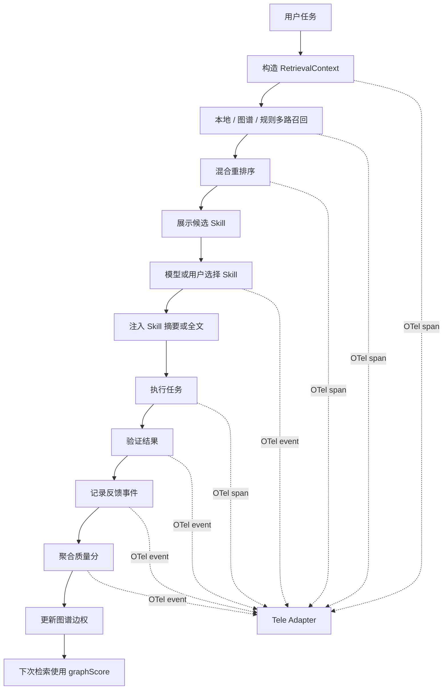
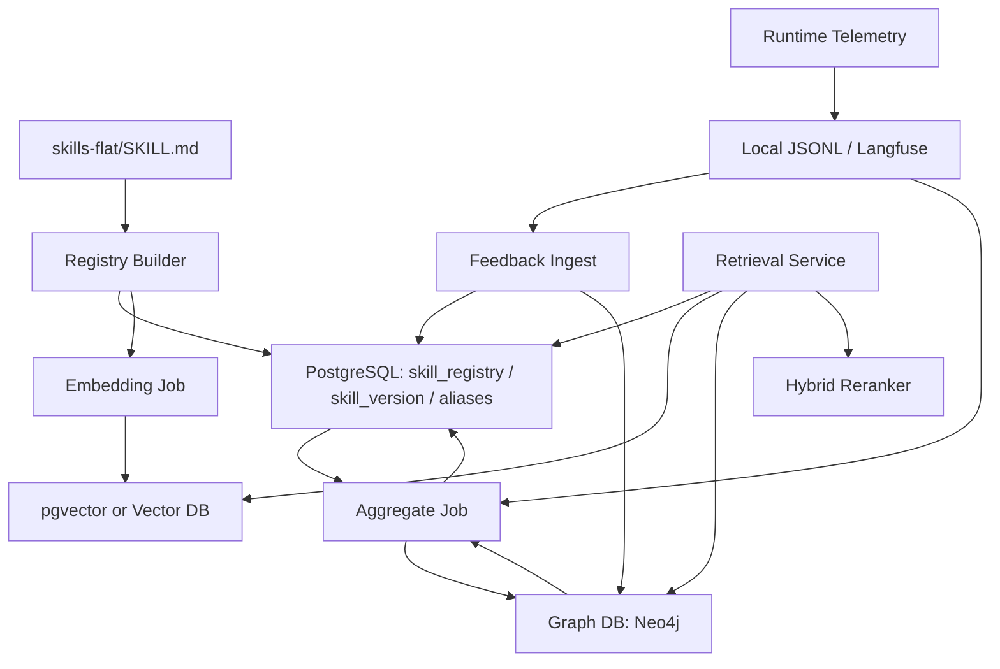

# Skill 知识图谱沉淀、反馈闭环与检索埋点设计

## 1. 文档目标

本文定义 Skill 从静态资产变成可持续学习的知识图谱资产时，需要遵循的元信息规范、反馈数据结构、图谱更新方式、评分统计方式、检索方式以及 OpenTelemetry/Tele 底层埋点方式。

本文补齐以下五件事：

1. Skill 元信息如何规范，才能沉淀成知识图谱。
2. Skill 使用后如何收集反馈，反馈结构怎么定义，如何更新图谱。
3. 知识图谱如何做评分统计，并把分数提供给检索阶段。
4. 检索 Skill 时如何在知识图谱中检索和重排序。
5. 整个链路如何用 OpenTelemetry/Tele 做底层埋点。

相关已有文档：

- [Skill 元信息编码映射规范](../reference/Skill元信息编码映射规范.md)
- [Skill 检索、注入与重排序方案](./20260411-skill-retrieval-injection-rerank.md)
- [Skill 从零检索到任务完成的评测与观测系统设计](./20260411-skill-evaluation-observability-design.md)

## 2. 总体原则

### 2.1 静态元信息和动态效果数据必须分离

`SKILL.md` frontmatter 只保存稳定、可审计、人工可维护的静态信息，例如 `skillId`、`domain`、`sceneTags`、`aliases`。

动态数据不得写回 `SKILL.md`，包括：

- 使用次数。
- 成功率。
- 用户评分。
- 最近使用时间。
- 检索排名。
- 成本和耗时。
- 某个项目或部门的偏好。

这些数据必须进入事件流、聚合快照或知识图谱边权。

### 2.2 Skill 身份必须稳定，效果必须按版本统计

图谱中至少要区分两个实体：

- `Skill`
  稳定逻辑身份，例如 `frontend/website-homepage-design`。
- `SkillVersion`
  某个版本的具体内容，由 `skillId + version + sourceHash` 唯一确定。

原因：

- 一个 Skill 内容升级后，不能把旧版本效果和新版本效果混在一起。
- 检索阶段默认推荐当前激活版本，但分析阶段必须能回看历史版本。

### 2.3 反馈必须可追溯到一次具体检索和一次具体任务

反馈不能只记录“某 Skill 得分 +1”。每条反馈必须能追溯：

- 哪个用户任务触发。
- 当时召回了哪些候选 Skill。
- 该 Skill 排在第几。
- 是谁选择的：用户、模型、系统规则。
- 是否真正加载并使用。
- 最终任务是否成功。
- 证据是什么：测试结果、构建结果、用户评价、人工复核等。

## 3. Skill 元信息规范

### 3.1 当前推荐 frontmatter 契约

每个 `SKILL.md` 必须包含以下字段：

```yaml
---
schemaVersion: '2026-04-11'
skillId: frontend/website-homepage-design
name: website-homepage-design
displayName: Website Homepage Design
description: 'Use when designing branded website homepages.'
aliases: [官网首页, 企业官网, homepage, website homepage]
version: '0.1.0'
sourceHash: 'sha256:...'
domain: frontend
departmentTags: [frontend-platform]
sceneTags: [design]
---
```

字段说明：

| 字段 | 是否必填 | 图谱用途 |
| --- | --- | --- |
| `schemaVersion` | 是 | 元信息解析版本，支持后续迁移 |
| `skillId` | 是 | `Skill` 主键，格式为 `{domain}/{name}` |
| `name` | 是 | 目录名和短名，必须 kebab-case |
| `displayName` | 是 | 展示名称，也用于文本检索 |
| `description` | 是 | 能力摘要，也用于文本检索 |
| `aliases` | 是 | 中文、英文、缩写、业务口语召回入口 |
| `version` | 是 | `SkillVersion` 版本 |
| `sourceHash` | 是 | `SkillVersion` 内容 hash，计算时排除 `sourceHash` 字段本身 |
| `domain` | 是 | `Domain` 节点和粗过滤 |
| `departmentTags` | 是 | `Department` 节点、部门过滤和偏好边 |
| `sceneTags` | 是 | `Scene` 节点、场景召回和评分聚合 |

当前仓库中历史 Skill 如果缺少 `aliases`，应在下一次元信息迁移中补齐。迁移时优先从目录名、`displayName`、`description`、中文场景词库和人工标注中生成。

### 3.2 可选扩展字段

在需要更细检索时，可增加以下字段：

```yaml
roleTags: [frontend-engineer, security-engineer]
techStack: [react, nextjs, postgresql]
capabilityTags: [review, implementation, debugging]
qualityTier: pro
sourceRepo: local
```

建议：

- `roleTags` 用于角色偏好，不替代 `departmentTags`。
- `techStack` 用于技术栈召回，不要写过宽泛的词。
- `capabilityTags` 用于动作类型，例如 review、test、deploy。
- `qualityTier` 可用于区分 `pro`、`basic`、`experimental`，但不应替代真实效果分数。
- `sourceRepo` 只记录来源，不表达可信度。

### 3.3 静态图谱映射

从 `SKILL.md` 元信息生成以下静态节点和边：

```text
(:Skill {skillId})
(:SkillVersion {skillId, version, sourceHash})
(:Domain {id})
(:Department {id})
(:Scene {id})
(:Alias {text})
(:Concept {id})
```

静态边：

```text
(Skill)-[:HAS_VERSION]->(SkillVersion)
(Skill)-[:IN_DOMAIN]->(Domain)
(Skill)-[:FOR_DEPARTMENT]->(Department)
(Skill)-[:FOR_SCENE]->(Scene)
(Skill)-[:HAS_ALIAS]->(Alias)
(Alias)-[:NORMALIZED_TO]->(Concept)
(Skill)-[:MENTIONS_CONCEPT]->(Concept)
```

注意：

- `Alias` 是用户说法，不是稳定语义主键。
- `Concept` 是归一化后的概念，例如 `dead-letter-queue`、`landing-page`、`rbac`。
- `SkillVersion` 只表示内容版本，不表示该版本一定是当前激活版本。

### 3.4 动态图谱不能从 frontmatter 生成

以下边必须来自事件聚合，而不是静态元信息：

```text
(Department)-[:PREFERS_SKILL]->(Skill)
(Scene)-[:SUCCESSFUL_WITH]->(Skill)
(Project)-[:FREQUENTLY_USES]->(Skill)
(Skill)-[:RELATED_BY_USAGE]->(Skill)
(SkillVersion)-[:HAS_QUALITY_SNAPSHOT]->(SkillQualitySnapshot)
```

这些边有权重、时间窗口、样本量和置信度，属于动态效果数据。

## 4. 反馈信息结构

### 4.1 反馈来源

反馈分为四类：

| 类型 | 来源 | 示例 |
| --- | --- | --- |
| 显式用户反馈 | 用户主动评分或评价 | 点赞、点踩、1-5 分、文字说明 |
| 隐式行为反馈 | runtime 自动采集 | 被展示、被选择、被调用、被跳过 |
| 自动验证反馈 | 系统验证结果 | 测试通过、构建通过、lint 通过、压测达标 |
| 人工/评测反馈 | reviewer 或 eval runner | 人工判定成功、LLM-as-judge、离线 benchmark |

### 4.2 原子反馈事件

每次 Skill 使用或候选曝光后，生成不可变的反馈事件：

```ts
type SkillFeedbackEvent = {
  eventId: string
  eventType: 'skill.feedback.recorded'
  timestamp: string

  traceId: string
  sessionId?: string
  conversationId?: string
  taskId: string
  retrievalRoundId?: string

  skillId: string
  skillName: string
  skillVersion: string
  sourceHash: string

  feedbackSource: 'user' | 'model' | 'system' | 'eval-runner' | 'reviewer'
  feedbackKind:
    | 'explicit-rating'
    | 'explicit-comment'
    | 'implicit-selection'
    | 'implicit-invocation'
    | 'implicit-skip'
    | 'verification-result'
    | 'task-outcome'
    | 'review-outcome'

  score?: number
  rating?: 1 | 2 | 3 | 4 | 5
  sentiment?: 'positive' | 'neutral' | 'negative'
  comment?: string

  taskOutcome?: {
    completed: boolean
    success: boolean
    userAccepted?: boolean
    requiredRework?: boolean
    reworkTurns?: number
  }

  verification?: {
    type: 'test' | 'build' | 'lint' | 'typecheck' | 'security-scan' | 'load-test' | 'manual'
    passed: boolean
    command?: string
    durationMs?: number
    summary?: string
  }

  retrievalContext?: {
    rank?: number
    candidateCount?: number
    recallSources?: string[]
    retrievalScore?: number
    rerankScore?: number
    selectedBy?: 'user' | 'model' | 'system'
  }

  context: {
    cwd?: string
    projectId?: string
    department?: string
    domainHints?: string[]
    sceneHints?: string[]
    referencedFiles?: string[]
    editedFiles?: string[]
  }

  evidenceRefs?: Array<{
    type: 'trace' | 'file' | 'command-output' | 'screenshot' | 'eval-report'
    uri: string
    summary?: string
  }>

  privacy: {
    containsUserText: boolean
    containsCode: boolean
    redactionLevel: 'none' | 'metadata-only' | 'redacted' | 'hashed'
  }
}
```

字段约束：

- `score` 统一归一化到 `[-1, 1]`。
- `rating` 保留用户原始 1-5 分，聚合时再映射。
- `eventId` 必须幂等，重复上报不能重复计数。
- `sourceHash` 必须记录，避免版本升级后效果串账。
- `comment`、`referencedFiles`、`editedFiles` 需要按隐私策略脱敏。

### 4.3 候选快照事件

只记录反馈不够，还要记录当时候选列表，否则无法计算 Recall@k、MRR、nDCG。

```ts
type SkillRetrievalSnapshot = {
  eventType: 'skill.retrieval.snapshot'
  traceId: string
  retrievalRoundId: string
  timestamp: string

  queryTextHash: string
  queryTextRedacted?: string
  registryVersion: string
  retrieverVersion: string
  rerankerVersion: string

  context: {
    cwd?: string
    department?: string
    domainHints?: string[]
    sceneHints?: string[]
    pathHints?: string[]
  }

  candidates: Array<{
    skillId: string
    version: string
    sourceHash: string
    rank: number
    recallSources: string[]
    recallScore: number
    rerankScore: number
    matchedAliases?: string[]
    matchedScenes?: string[]
    matchedDepartments?: string[]
  }>

  injectedSkillIds: string[]
  userVisibleSkillIds: string[]
}
```

### 4.4 使用事件和反馈事件的关系

推荐的事件链：

```text
skill.retrieval.snapshot
  -> skill.presented
  -> skill.selected
  -> skill.injected
  -> skill.invoked
  -> task.verification.completed
  -> skill.feedback.recorded
  -> graph.feedback_aggregate.updated
```

并不是每个候选都会进入 `selected` 或 `invoked`。未被选择也是重要负反馈，但权重要低于用户明确点踩。

## 5. 反馈如何更新知识图谱

### 5.1 写入策略

采用两层写入：

1. 原始事件层
   追加写入 JSONL / Langfuse / OTel trace，不做覆盖。
2. 图谱聚合层
   定时或流式消费事件，更新节点属性、聚合节点和边权。

不要在用户反馈发生时直接修改 Skill 静态元信息。

### 5.2 图谱更新对象

每条反馈事件至少更新以下对象：

```text
(:FeedbackEvent {eventId})
(:TaskContext {taskId})
(:SkillUsageSnapshot {skillId, window, scope})
```

关系：

```text
(FeedbackEvent)-[:ABOUT_SKILL]->(Skill)
(FeedbackEvent)-[:ABOUT_VERSION]->(SkillVersion)
(FeedbackEvent)-[:IN_TASK]->(TaskContext)
(TaskContext)-[:USED_SKILL]->(Skill)
(SkillVersion)-[:HAS_FEEDBACK_EVENT]->(FeedbackEvent)
```

聚合后更新动态边：

```text
(Department)-[:PREFERS_SKILL {
  score,
  sampleCount,
  successRate,
  lastUpdatedAt,
  window
}]->(Skill)

(Scene)-[:SUCCESSFUL_WITH {
  score,
  sampleCount,
  taskSuccessRate,
  userSatisfaction,
  window
}]->(Skill)

(Project)-[:FREQUENTLY_USES {
  invocationCount,
  selectionRate,
  successRate,
  window
}]->(Skill)
```

### 5.3 反馈权重建议

不同反馈来源权重不同：

| 反馈信号 | 建议权重 | 说明 |
| --- | ---: | --- |
| 用户明确 5 分 / 点赞 | +1.00 | 强正反馈 |
| 用户明确 1 分 / 点踩 | -1.00 | 强负反馈 |
| 人工 reviewer 判定成功 | +0.90 | 强正反馈 |
| 测试/构建/验证通过 | +0.60 | 中强正反馈 |
| 模型选择并成功调用 | +0.25 | 弱正反馈 |
| 仅被展示但未选择 | -0.05 | 极弱负反馈 |
| 被选择后未调用 | -0.20 | 弱负反馈 |
| 任务失败且使用了 Skill | -0.50 | 中强负反馈 |
| 用户要求换 Skill | -0.70 | 强负反馈 |

### 5.4 时间衰减

图谱评分必须支持时间窗口：

- `7d`
- `30d`
- `90d`
- `all`

推荐使用指数衰减：

```text
decayedWeight = rawWeight * exp(-ageDays / halfLifeDays)
```

建议半衰期：

- 高频线上反馈：`30d`
- 离线评测反馈：`90d`
- 人工专家标注：`180d`

## 6. 知识图谱评分统计

### 6.1 评分目标

图谱评分不是为了给 Skill 打一个绝对好坏分，而是为检索阶段提供排序特征。

评分必须回答：

- 在这个部门里，哪个 Skill 更常被成功使用。
- 在这个场景下，哪个 Skill 更可能帮助任务完成。
- 在这个项目里，哪个 Skill 更符合团队习惯。
- 当前 SkillVersion 是否比旧版本更好。
- 某个 Skill 是否最近质量下降。

### 6.2 核心聚合指标

对每个 `Skill`、`SkillVersion`、`Department-Skill`、`Scene-Skill`、`Project-Skill` 统计：

```ts
type SkillQualityAggregate = {
  scope:
    | 'global-skill'
    | 'skill-version'
    | 'department-skill'
    | 'scene-skill'
    | 'project-skill'
    | 'department-scene-skill'

  scopeId: string
  skillId: string
  version?: string
  sourceHash?: string
  window: '7d' | '30d' | '90d' | 'all'

  impressions: number
  selections: number
  invocations: number
  taskAttempts: number
  taskSuccesses: number
  verificationPasses: number
  explicitPositive: number
  explicitNegative: number

  selectionRate: number
  invocationRate: number
  taskSuccessRate: number
  verificationPassRate: number
  userSatisfaction: number
  avgRankWhenShown: number
  avgLatencyMs?: number
  avgTokenCost?: number

  qualityScore: number
  confidence: number
  lastUpdatedAt: string
}
```

### 6.3 分数公式

推荐先使用可解释线性公式：

```text
qualityScore =
  0.30 * taskSuccessRate +
  0.20 * userSatisfaction +
  0.15 * verificationPassRate +
  0.15 * invocationRate +
  0.10 * selectionRate +
  0.10 * freshnessScore -
  0.05 * costPenalty -
  0.05 * failurePenalty
```

置信度单独计算：

```text
confidence = min(1, log(1 + sampleCount) / log(1 + targetSampleCount))
```

最终给检索使用时，不直接用 `qualityScore`，而使用置信度校准后的分数：

```text
graphScore = confidence * qualityScore + (1 - confidence) * priorScore
```

其中 `priorScore` 可来自：

- 静态元信息匹配。
- 人工认证等级。
- 同 domain / scene 的平均效果。
- 冷启动默认值。

### 6.4 冷启动策略

新 Skill 没有使用数据时：

- 不应该因为没有历史数据被完全压下去。
- 也不应该因为静态描述很像就压过长期高质量 Skill。

建议：

```text
coldStartBoost =
  0.05 if metadataMatchStrong
  0.10 if userExplicitlyRequested
  0.00 otherwise
```

同时给新 Skill 设置探索流量：

```text
explorationRate = 5% ~ 10%
```

探索只影响候选展示，不应强制模型使用。

## 7. 检索阶段如何使用知识图谱

### 7.1 检索输入

检索阶段构造统一上下文：

```ts
type GraphRetrievalContext = {
  queryText: string
  queryTextHash: string
  cwd: string
  projectId?: string
  department?: string
  userRole?: string
  domainHints: string[]
  sceneHints: string[]
  conceptHints: string[]
  pathHints: string[]
  referencedFiles: string[]
  editedFiles: string[]
  priorInjectedSkillIds: string[]
  priorInvokedSkillIds: string[]
}
```

### 7.2 图谱检索路径

推荐采用多路召回：

```text
文本 query
  -> Alias / Concept 命中
  -> Scene / Domain / Department 过滤
  -> Skill 候选
  -> SkillVersion 当前激活版本
  -> 动态评分边补充 graphScore
  -> 和 BM25 / 向量 / 规则结果融合
```

图谱召回路径示例：

```cypher
MATCH (a:Alias)-[:NORMALIZED_TO]->(c:Concept)<-[:MENTIONS_CONCEPT]-(s:Skill)
WHERE a.text IN $queryAliases OR c.id IN $conceptHints
OPTIONAL MATCH (s)-[:FOR_SCENE]->(scene:Scene)
OPTIONAL MATCH (s)-[:IN_DOMAIN]->(domain:Domain)
OPTIONAL MATCH (s)-[:FOR_DEPARTMENT]->(dept:Department)
RETURN s, scene, domain, dept
```

部门 + 场景成功率召回：

```cypher
MATCH (dept:Department {id: $department})-[p:PREFERS_SKILL]->(s:Skill)
OPTIONAL MATCH (scene:Scene)-[sw:SUCCESSFUL_WITH]->(s)
WHERE scene.id IN $sceneHints
RETURN s, p.score AS departmentScore, sw.score AS sceneScore
ORDER BY departmentScore DESC, sceneScore DESC
LIMIT 20
```

项目习惯召回：

```cypher
MATCH (project:Project {id: $projectId})-[u:FREQUENTLY_USES]->(s:Skill)
RETURN s, u.successRate, u.invocationCount
ORDER BY u.successRate DESC, u.invocationCount DESC
LIMIT 20
```

### 7.3 混合重排序公式

图谱不替代文本检索，图谱提供额外排序特征。

推荐公式：

```text
finalScore =
  0.25 * textRecallScore +
  0.15 * aliasConceptScore +
  0.15 * sceneMatchScore +
  0.10 * domainMatchScore +
  0.10 * departmentPreferenceScore +
  0.10 * graphQualityScore +
  0.05 * projectAffinityScore +
  0.05 * pathContextBoost +
  0.05 * explorationBoost -
  0.10 * repeatedInjectionPenalty -
  0.10 * staleVersionPenalty
```

说明：

- `textRecallScore` 负责理解当前任务文字。
- `aliasConceptScore` 解决中英文和业务口语差异。
- `departmentPreferenceScore` 来自 `Department -> PREFERS_SKILL`。
- `graphQualityScore` 来自质量聚合分。
- `projectAffinityScore` 来自项目历史使用偏好。
- `staleVersionPenalty` 降低过期版本或低可信版本。

### 7.4 检索输出

检索输出必须保留可解释性：

```ts
type GraphRankedSkill = {
  skillId: string
  name: string
  displayName: string
  version: string
  sourceHash: string
  rank: number
  finalScore: number

  scoreBreakdown: {
    textRecallScore: number
    aliasConceptScore: number
    sceneMatchScore: number
    domainMatchScore: number
    departmentPreferenceScore: number
    graphQualityScore: number
    projectAffinityScore: number
    pathContextBoost: number
    explorationBoost: number
    penalties: Record<string, number>
  }

  matchedBy: string[]
  evidence: Array<{
    type: 'alias' | 'concept' | 'scene' | 'department' | 'project' | 'quality'
    value: string
    score?: number
  }>
}
```

这份输出一方面用于模型注入，另一方面用于后续 trace 和反馈归因。

## 8. OpenTelemetry / Tele 埋点设计

### 8.1 定位

OpenTelemetry/Tele 只做底层事件协议和 trace/span 组织，不直接承担：

- 图谱数据库。
- 离线评测平台。
- 用户评分 UI。
- 长期质量报表。

它的职责是把 runtime 中发生的事实稳定记录下来，并能被多个 sink 消费：

- 本地 JSONL。
- Langfuse / Phoenix。
- OTel Collector。
- 图谱写入任务。
- 数据仓库。

### 8.2 Trace 层级

每个用户任务对应一个 trace：

```text
skill.task
```

建议 span：

```text
skill.context.build
skill.graph.retrieve
skill.local.retrieve
skill.hybrid.rerank
skill.present
skill.select
skill.inject
skill.invoke
task.execute
task.verify
feedback.record
graph.aggregate
```

### 8.3 Span 和事件命名

事件名：

| 事件名 | 触发时机 |
| --- | --- |
| `skill.metadata.loaded` | Skill registry 或 graph metadata 加载完成 |
| `skill.context.built` | 检索上下文构造完成 |
| `skill.graph.retrieve.started` | 图谱召回开始 |
| `skill.graph.retrieve.completed` | 图谱召回完成 |
| `skill.hybrid.rerank.completed` | 混合重排序完成 |
| `skill.presented` | 候选 Skill 展示给模型或用户 |
| `skill.selected` | 用户、模型或系统选择 Skill |
| `skill.injected` | Skill 摘要或全文注入 |
| `skill.invoked` | Skill 实际加载使用 |
| `task.verification.completed` | 构建、测试、扫描、人工验证完成 |
| `skill.feedback.recorded` | 反馈事件写入 |
| `skill.graph.aggregate.updated` | 图谱聚合完成 |

### 8.4 全局属性

所有 span/event 应包含：

```ts
type SkillTelemetryAttributes = {
  'skill.trace_id': string
  'skill.session_id'?: string
  'skill.conversation_id'?: string
  'skill.task_id': string
  'skill.retrieval_round_id'?: string

  'skill.registry_version': string
  'skill.metadata_schema_version': string
  'skill.graph_schema_version'?: string
  'skill.retriever_version': string
  'skill.reranker_version': string

  'app.cwd_hash'?: string
  'app.project_id'?: string
  'app.department'?: string
  'app.model'?: string

  'privacy.redaction_level': 'none' | 'metadata-only' | 'redacted' | 'hashed'
}
```

### 8.5 检索 span 属性

```ts
type SkillRetrieveSpanAttributes = SkillTelemetryAttributes & {
  'skill.retrieve.source': 'graph' | 'bm25' | 'vector' | 'rule' | 'hybrid'
  'skill.retrieve.query_hash': string
  'skill.retrieve.candidate_count': number
  'skill.retrieve.duration_ms': number
  'skill.retrieve.top_skill_ids': string[]
  'skill.retrieve.domain_hints': string[]
  'skill.retrieve.scene_hints': string[]
}
```

### 8.6 重排序 span 属性

```ts
type SkillRerankSpanAttributes = SkillTelemetryAttributes & {
  'skill.rerank.input_count': number
  'skill.rerank.output_count': number
  'skill.rerank.top_skill_ids': string[]
  'skill.rerank.score_breakdown_schema': string
  'skill.rerank.duration_ms': number
}
```

### 8.7 使用和反馈事件属性

```ts
type SkillUseEventAttributes = SkillTelemetryAttributes & {
  'skill.id': string
  'skill.name': string
  'skill.version': string
  'skill.source_hash': string
  'skill.rank'?: number
  'skill.selected_by'?: 'user' | 'model' | 'system'
  'skill.invoked': boolean
  'skill.feedback_score'?: number
  'skill.feedback_source'?: 'user' | 'model' | 'system' | 'eval-runner' | 'reviewer'
  'task.success'?: boolean
  'task.verification_passed'?: boolean
}
```

### 8.8 本地 Tele Adapter

建议 runtime 不直接依赖某个平台 SDK，而是先封装一层：

```ts
type SkillTelemetry = {
  startSpan(name: string, attrs: Record<string, unknown>): SpanHandle
  recordEvent(name: string, attrs: Record<string, unknown>): void
  recordFeedback(event: SkillFeedbackEvent): void
  flush(): Promise<void>
}
```

底层 sink：

```ts
type SkillTelemetrySink =
  | 'local-jsonl'
  | 'otel'
  | 'langfuse'
  | 'graph-ingest'
```

运行时要求：

- Telemetry 失败不能影响主任务执行。
- 默认可以只写本地 JSONL。
- 网络 sink 失败时要降级和重试。
- 任何包含用户文本或代码片段的字段必须走脱敏策略。

## 9. 端到端流程



## 10. 推荐落地阶段

### Phase 1：静态图谱和事件骨架

- 补齐 `aliases` 元信息。
- 从 `skills-flat/` 构建静态 Skill 图谱。
- 实现本地 `SkillRetrievalSnapshot` JSONL。
- 记录 `selected`、`invoked`、`verification`、`feedback` 事件。

### Phase 2：反馈聚合和检索特征

- 实现 `SkillQualityAggregate`。
- 生成 `Department -> PREFERS_SKILL`、`Scene -> SUCCESSFUL_WITH` 等边权。
- 将 `graphQualityScore`、`departmentPreferenceScore` 接入 reranker。
- 在候选展示中显示 score breakdown。

### Phase 3：OpenTelemetry / Langfuse / 图谱联动

- 接入 OTel SDK 或 OTel Collector。
- 将同一事件写入 Langfuse 和本地图谱 ingest。
- 增加离线 benchmark、transcript replay 和人工评分。
- 对比不同检索器和不同 SkillVersion 的效果。

### Phase 4：在线优化

- 引入时间衰减和探索流量。
- 针对部门、项目、场景做个性化排序。
- 对低置信 Skill 做安全探索，对高风险任务降低探索比例。
- 形成可解释的 Skill 推荐面板和质量报表。

## 11. 数据库与存储选型

### 11.1 结论

当前系统需要三类存储，不建议一开始把所有职责塞进一个数据库：

| 存储类型 | 是否需要 | 推荐阶段 | 主要职责 |
| --- | --- | --- | --- |
| 关系型数据库 | 必需 | V1 | Skill registry 快照、反馈事件索引、聚合分、任务元数据 |
| 向量检索能力 | 需要，但 V1 不一定要独立向量库 | V1-V2 | Skill 语义召回、别名扩展、长描述相似度检索 |
| 图谱数据库 | 目标架构必需 | V2-V3 | Skill、部门、场景、项目、反馈、版本之间的关系和边权 |
| 事件/Trace 存储 | 必需 | V1 | 原始 telemetry、可回放证据、调试数据 |
| 搜索引擎 | 可选 | V2+ | BM25、日志式检索、混合文本搜索 |

推荐路线：

```text
V1:
  PostgreSQL + pgvector + 本地 JSONL
  先把 registry、反馈、聚合分和少量 embedding 放在一个 Postgres 里。

V2:
  PostgreSQL + pgvector + Neo4j + JSONL/Langfuse
  图谱关系进入 Neo4j，Postgres 继续作为事实表和聚合表。

V3:
  PostgreSQL + Neo4j + 专用向量库 或 OpenSearch/Weaviate
  当 Skill、文档、历史任务、反馈证据规模上来后，把向量检索拆出去。
```

### 11.2 为什么 V1 不建议直接上专用向量数据库

如果当前 Skill 数量是几十到几千级，V1 阶段直接引入专用向量数据库通常收益不高。原因：

- Skill 召回首先依赖稳定元信息：`skillId`、`aliases`、`domain`、`departmentTags`、`sceneTags`。
- 大部分场景可以先靠精确匹配、BM25、规则过滤和 `pgvector` 语义召回解决。
- 早期最重要的是把事件 schema、反馈闭环和评分聚合跑通。
- 独立向量库会增加部署、同步、权限、备份和一致性成本。

V1 推荐用 PostgreSQL 承担两件事：

- 关系数据：registry、feedback、aggregate、retrieval_snapshot。
- 轻量向量：Skill embedding、alias embedding、description embedding。

`pgvector` 官方支持在 Postgres 中存储向量，并支持 exact / approximate nearest neighbor、HNSW、IVFFlat、cosine / L2 / inner product 等距离函数；这足够支撑早期 Skill 语义召回。参考：[pgvector](https://github.com/pgvector/pgvector)。

### 11.3 什么时候需要独立向量数据库

满足以下任意条件时，再考虑独立向量库：

- Skill 不只是 100 个，而是扩展到数万级。
- 检索对象不只 Skill，还包括历史任务、代码片段、文档块、反馈证据、案例库。
- 需要高 QPS、低延迟、多租户隔离和复杂 metadata filter。
- embedding 更新频繁，Postgres vacuum / index 维护开始影响主库。
- 需要多向量字段、混合搜索、向量分片、在线扩容或专门的向量检索运维能力。

候选选型：

| 方案 | 适合场景 | 优点 | 风险 |
| --- | --- | --- | --- |
| `pgvector` | V1/V2、小中规模、想减少组件 | 和 Postgres 事务、JOIN、备份体系统一 | 大规模 ANN 和高 QPS 下会受主库资源限制 |
| Qdrant | 专用向量服务、metadata filter 多、高 QPS | payload 可存 JSON，并支持基于 payload 的过滤；部署相对轻 | 还需要额外 BM25 或图谱系统 |
| Weaviate | 想要向量 + BM25 混合搜索一体化 | 官方支持 hybrid search，把向量搜索和 BM25 结果融合 | 需要适配其对象模型和运维体系 |
| OpenSearch | 团队已有 OpenSearch/Elastic 体系 | 文本搜索、日志检索、向量搜索可放同一搜索平台 | 作为主向量库时调参和资源隔离更复杂 |

参考资料：

- Qdrant payload 支持 JSON metadata 和过滤：[Qdrant Payload](https://qdrant.tech/documentation/concepts/payload/)
- Weaviate hybrid search 同时融合 vector 和 BM25：[Weaviate Hybrid Search](https://docs.weaviate.io/weaviate/search/hybrid)
- OpenSearch 支持向量搜索和 k-NN filtering：[OpenSearch Vector Search](https://docs.opensearch.org/latest/vector-search/filter-search-knn/index/)

### 11.4 图谱数据库要不要

要。只要目标是“知识图谱沉淀”，图谱数据库就是目标架构的一部分。

但是图谱数据库不一定是 V1 第一优先级。V1 可以先用 Postgres 表模拟节点、边和聚合；当以下需求出现时，再切到真正图数据库：

- 需要多跳查询，例如“某部门在安全审查场景下偏好哪些 Skill，这些 Skill 又和哪些失败案例相关”。
- 需要按边权做推荐，例如 `Department -> PREFERS_SKILL -> Skill`。
- 需要解释推荐路径，例如“因为你在 backend-platform、任务命中 auth 和 security-audit，所以推荐这个 Skill”。
- 需要图算法，例如 PageRank、community detection、相似 Skill 聚类、低质量 Skill 社区识别。
- 需要把 Alias、Concept、Scene、Department、Project、SkillVersion、FeedbackEvent 统一成关系网络。

推荐选型：

| 方案 | 适合场景 | 优点 | 风险 |
| --- | --- | --- | --- |
| Neo4j | V2 首选，知识图谱、推荐解释、多跳查询 | Cypher 成熟，图查询表达清晰，支持 vector index 和 Graph Data Science | 需要单独运维和数据同步 |
| ArangoDB | 想要文档 + 图 + 搜索的多模型数据库 | 单系统多模型，适合中等复杂度 | 图生态和 GDS 能力通常不如 Neo4j 聚焦 |
| TigerGraph | 大规模图计算、强并行图分析 | 适合非常大的企业级图分析 | 语言、运维和团队学习成本更高 |
| Postgres 边表 | V1 过渡方案 | 成本最低，易备份，易接现有系统 | 多跳查询和图算法能力弱 |

Neo4j 官方支持 vector index，可对节点或关系向量做近邻查询；同时 Neo4j Graph Data Science 提供 PageRank、community detection 等图算法。参考：[Neo4j Vector Indexes](https://neo4j.com/docs/cypher-manual/current/indexes/semantic-indexes/vector-indexes)、[Neo4j GDS PageRank](https://neo4j.com/docs/graph-data-science/current/algorithms/page-rank/)、[Neo4j GDS Community Detection](https://neo4j.com/docs/graph-data-science/current/algorithms/community/)。

### 11.5 推荐的逻辑架构



推荐职责拆分：

| 组件 | 保存什么 |
| --- | --- |
| PostgreSQL | registry 当前状态、SkillVersion、反馈事实表、聚合分、检索快照索引 |
| pgvector / 向量库 | Skill、alias、description、案例、历史任务的 embedding |
| Neo4j | Skill 图谱、动态边权、推荐路径、Concept 关系、版本关系 |
| JSONL / Langfuse | 原始 trace、prompt、候选列表、模型行为、人工评价证据 |
| OpenSearch | 可选，全文检索、日志检索、BM25 baseline |

### 11.6 推荐表结构草案

PostgreSQL 表：

```sql
skill_registry(
  skill_id text primary key,
  name text not null,
  display_name text not null,
  description text not null,
  domain text not null,
  department_tags text[] not null,
  scene_tags text[] not null,
  aliases text[] not null,
  active_version text not null,
  active_source_hash text not null,
  updated_at timestamptz not null
)

skill_version(
  skill_id text not null,
  version text not null,
  source_hash text not null,
  content_path text not null,
  created_at timestamptz not null,
  primary key(skill_id, version, source_hash)
)

skill_feedback_event(
  event_id text primary key,
  trace_id text not null,
  task_id text not null,
  skill_id text not null,
  version text not null,
  source_hash text not null,
  feedback_source text not null,
  feedback_kind text not null,
  score double precision,
  payload jsonb not null,
  created_at timestamptz not null
)

skill_quality_aggregate(
  scope text not null,
  scope_id text not null,
  skill_id text not null,
  version text,
  source_hash text,
  window text not null,
  quality_score double precision not null,
  confidence double precision not null,
  sample_count integer not null,
  payload jsonb not null,
  updated_at timestamptz not null,
  primary key(scope, scope_id, skill_id, window)
)
```

Postgres `jsonb` 适合保存可索引的半结构化 payload，例如反馈详情、检索快照摘要和验证结果；官方文档说明 `jsonb` 支持 JSON 存储、函数、操作符和索引能力。参考：[PostgreSQL JSON Types](https://www.postgresql.org/docs/current/static/datatype-json.html)。

Neo4j 节点和边：

```cypher
(:Skill {skillId})
(:SkillVersion {skillId, version, sourceHash})
(:Department {id})
(:Scene {id})
(:Project {id})
(:Concept {id})
(:FeedbackEvent {eventId})

(:Skill)-[:HAS_VERSION]->(:SkillVersion)
(:Skill)-[:FOR_DEPARTMENT]->(:Department)
(:Skill)-[:FOR_SCENE]->(:Scene)
(:Skill)-[:MENTIONS_CONCEPT]->(:Concept)
(:Department)-[:PREFERS_SKILL {score, confidence, sampleCount, window}]->(:Skill)
(:Scene)-[:SUCCESSFUL_WITH {score, confidence, sampleCount, window}]->(:Skill)
(:Project)-[:FREQUENTLY_USES {score, invocationCount, window}]->(:Skill)
```

向量表或向量库 collection：

```text
skill_embedding
  id = skillId + version + sourceHash + field
  vector = embedding(displayName + description + aliases + selected SKILL.md summary)
  payload = {
    skillId,
    version,
    sourceHash,
    domain,
    departmentTags,
    sceneTags,
    field
  }
```

### 11.7 选型决策矩阵

| 问题 | 选择 |
| --- | --- |
| 只有 100-5000 个 Skill，要先跑通闭环 | PostgreSQL + pgvector + JSONL |
| 需要长期知识图谱沉淀和可解释多跳推荐 | Neo4j |
| 已经有 OpenSearch，且 BM25/日志检索很重 | OpenSearch 做搜索补充，不做唯一事实源 |
| 语义检索对象扩展到大量文档块、代码块、历史任务 | Qdrant 或 Weaviate |
| 强依赖 hybrid vector + BM25 一体化 | Weaviate 或 OpenSearch |
| 要最少组件、最少运维 | Postgres + pgvector，图谱先用边表模拟 |
| 要图算法和推荐解释 | Neo4j + GDS |
| 要企业级超大图计算 | 评估 TigerGraph |

### 11.8 本项目推荐

对当前仓库和 100 个 Skill 的规模，推荐：

1. V1 使用 PostgreSQL + pgvector + 本地 JSONL。
2. 先不要引入独立向量数据库。
3. 图谱先用 Postgres 边表或本地导出模拟，等反馈事件跑起来后接 Neo4j。
4. V2 将静态关系和动态边权写入 Neo4j，用 Neo4j 提供多跳解释和图谱特征。
5. V3 如果检索对象从 Skill 扩展到大量代码片段、历史任务和文档块，再引入 Qdrant / Weaviate / OpenSearch。

一句话结论：

```text
当前阶段：PostgreSQL + pgvector 足够启动。
知识图谱阶段：Neo4j 是推荐主选。
大规模语义检索阶段：再引入专用向量库，不要一开始就上。
```

## 12. 最小可执行 checklist

如果只做第一版，必须完成：

- `SKILL.md` frontmatter 包含 `aliases`。
- 每次检索记录 `SkillRetrievalSnapshot`。
- 每次选择、注入、调用记录事件。
- 每次任务结束记录验证结果和反馈事件。
- 每天或每次 eval run 后聚合 `SkillQualityAggregate`。
- reranker 至少读取 `graphQualityScore` 和 `departmentPreferenceScore`。
- Telemetry 通过统一 adapter 写本地 JSONL，后续再接 Langfuse/OTel。
- V1 数据库使用 PostgreSQL + pgvector；图谱先边表模拟，V2 再接 Neo4j。
