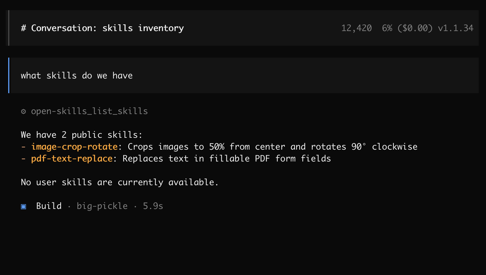

<div align="center">

[](https://github.com/BandarLabs/open-skills/stargazers)
[](https://github.com/BandarLabs/open-skills/blob/master/LICENSE)
</div>

```
    ___  ____  _____ _   _     ____  _  _____ _     _     ____
   / _ \|  _ \| ____| \ | |   / ___|| |/ /_ _| |   | |   / ___|
  | | | | |_) |  _| |  \| |   \___ \| ' / | || |   | |   \___ \
  | |_| |  __/| |___| |\  |    ___) | . \ | || |___| |___ ___) |
   \___/|_|   |_____|_| \_|   |____/|_|\_\___|_____|_____|____/

```


# OpenSkills: Run Claude Skills Locally on Your Mac

Anthropic recently announced [Skills for Claude](https://www.anthropic.com/news/skills) - reusable folders with instructions, scripts, and resources that make Claude better at specialized tasks. This tool lets you run these skills **entirely on your local machine** in a sandboxed environment.

**What this means:** You can now process your files (documents, spreadsheets, presentations, images) using these specialized skills while keeping all data on your Mac. No uploads, complete privacy.

> This tool executes AI-generated code in a truly isolated sandboxed environment on your Mac using Apple's native containers.

## Demo

Watch Open-Skills in action with Gemini CLI:


## Why Run Skills Locally?

- **Privacy:** Process sensitive documents, financial data
- **Full Control:** Skills execute in an isolated container with VM-level isolation
- **Compatibility:** Works with Claude Desktop, Gemini CLI, Qwen CLI, or any MCP-compatible tool
- **Extensibility:** Import Anthropic's official skills or create your own custom skills

## Quick Start

**Prerequisites:** Mac with macOS and Apple Silicon (M1/M2/M3/M4/M5), Python 3.10+

```bash
git clone https://github.com/BandarLabs/open-skills.git
cd open-skills
chmod +x install.sh
./install.sh
```

Installation takes ~2 minutes. The MCP server will be available at `http://open-skills.local:8222/mcp`

**Install required packages** (use virtualenv and note the python path):
```bash
pip install -r examples/requirements.txt
```

## Setup: Connect Your AI Tool

This MCP server works with any MCP-compatible tool. All execution happens locally on your Mac.

### Option 1: Claude Desktop Integration

Configure Claude Desktop to use this MCP server:

1. **Copy the example configuration:**
   ```bash
   cd examples
   cp claude_desktop/claude_desktop_config.example.json claude_desktop/claude_desktop_config.json
   ```

2. **Edit the configuration file** and replace the placeholder paths:
   - Replace `/path/to/your/python` with your actual Python path (e.g., `/usr/bin/python3` or `/opt/homebrew/bin/python3`)
   - Replace `/path/to/open-skills` with the actual path to your cloned repository

   Example after editing:
   ```json
   {
     "mcpServers": {
       "open-skills": {
         "command": "/opt/homebrew/bin/python3",
         "args": ["/Users/yourname/open-skills/examples/claude_desktop/mcpproxy.py"]
       }
     }
   }
   ```

3. **Update Claude Desktop configuration:**
   - Open Claude Desktop
   - Go to Settings → Developer
   - Add the MCP server configuration
   - Restart Claude Desktop

### Option 2: OpenCode Configuration

For OpenCode users, create `~/.config/opencode/opencode.json`:



```json
{
  "$schema": "https://opencode.ai/config.json",
  "mcp": {
    "open-skills": {
      "type": "remote",
      "url": "http://open-skills.local:8222/mcp",
      "enabled": true
    }
  }
}
```

### Option 3: Gemini CLI Configuration

Edit `~/.gemini/settings.json`:

```json
{
  "theme": "Default",
  "selectedAuthType": "oauth-personal",
  "mcpServers": {
    "open-skills": {
      "httpUrl": "http://open-skills.local:8222/mcp"
    }
  }
}
```

For system instructions, replace `~/.gemini/GEMINI.md` with [GEMINI.md](examples/gemini_cli/GEMINI.md)

### Option 3: Python OpenAI Agents

Use this server with OpenAI's Python agents library:

1. **Set your OpenAI API key:**
   ```bash
   export OPENAI_API_KEY="your-openai-api-key-here"
   ```

2. **Run the client:**
   ```bash
   python examples/openai_agents/openai_client.py
   ```

### Other Supported Tools

- **Qwen CLI:** Configure similar to Gemini CLI
- **Kiro by Amazon:** See examples in this repository for configuration
- **Any MCP client:** Point to `http://open-skills.local:8222/mcp`

## Example Use Cases

Once configured, you can ask your AI to:

- "Create a professional PowerPoint presentation from this markdown outline"
- "Extract all tables from these 10 PDFs and combine into one Excel spreadsheet"
- "Generate ASCII art logo for my project"
- "Fill out this tax form PDF with data from my CSV file"
- "Batch process these 100 images: crop to 16:9 and rotate 90 degrees"


## Adding New Skills

You can extend this server with additional skills in two ways:

### Option 1: Import Anthropic's Official Skills

Download skills from [Anthropic's skills repository](https://github.com/anthropics/skills/) and copy to:

```
~/.open-skills/assets/skills/user/<new-skill-folder>
```

**Available Official Skills:**
- Microsoft Word (docx)
- Microsoft PowerPoint (pptx)
- Microsoft Excel (xlsx)
- PDF manipulation
- Image processing
- Slack GIF creator
- And more...

### Skills Directory Structure

Here's an example with 4 imported skills:
```shell
~/.open-skills/assets/skills/
├── public
│   ├── image-crop-rotate
│   │   ├── scripts
│   │   └── SKILL.md
│   └── pdf-text-replace
│       ├── scripts
│       └── SKILL.md
└── user
    ├── docx
    │   ├── docx-js.md
    │   ├── LICENSE.txt
    │   ├── ooxml
    │   ├── ooxml.md
    │   ├── scripts
    │   └── SKILL.md
    ├── pptx
    │   ├── html2pptx.md
    │   ├── LICENSE.txt
    │   ├── ooxml
    │   ├── ooxml.md
    │   ├── scripts
    │   └── SKILL.md
    ├── slack-gif-creator
    │   ├── core
    │   ├── LICENSE.txt
    │   ├── requirements.txt
    │   ├── SKILL.md
    │   └── templates
    └── xlsx
        ├── LICENSE.txt
        ├── recalc.py
        └── SKILL.md
```


### Option 2: Create Your Own Skills

Create a folder matching the structure shown above. The only mandatory file is `SKILL.md`. See [Anthropic's skills documentation](https://docs.claude.com/en/docs/agents-and-tools/agent-skills/overview) for details.

**Quick Method:**
Ask Claude to generate a skill for you:

> "Can you write a skill which creates ASCII art of words?"

Claude will create the skill and offer a ZIP download. Place the ZIP file directly in `~/.open-skills/assets/skills/user` (no need to expand).

**Manual Method:**
Create your own skill folder structure:

```
~/.open-skills/assets/skills/user/my-custom-skill/
├── SKILL.md              # Documentation and usage examples
├── scripts/              # Your Python/bash scripts
│   └── process.py
└── requirements.txt      # (optional) Python dependencies
```

## How Folder Mapping Works

This MCP server provides a compatibility layer that lets you run Claude's skills locally without modification:

**Path Translation:**
- Claude's path: `/mnt/user-data` → Local path: `/app/uploads`
- Skills designed for Claude work locally without any changes

**File Sharing - How to Share Files with Skills:**
To share your local files with skills for processing:

1. **Place files in the outputs directory:**
   ```bash
   cp your-file.pdf ~/.open-skills/assets/outputs/
   cp your-image.png ~/.open-skills/assets/outputs/
   ```

2. **Files become available inside the container:**
   - Your files in `~/.open-skills/assets/outputs/` are automatically mounted
   - Skills can access them via `/mnt/user-data/` (the standard Claude path)
   - No manual copying or cloud uploads required

3. **Processed files appear in the same directory:**
   - Output files are saved back to `~/.open-skills/assets/outputs/`
   - You can access results immediately on your Mac

**Skill Structure:**
- No changes needed to imported skills
- Original folder hierarchy and file organization remain identical
- Import Claude skills and use them directly

## Live Demo: ASCII Art Skill

Here's a real example using Gemini CLI:

```
> /mcp

Configured MCP servers:

🟢 open-skills - Ready (5 tools)
  Tools:
  - execute_python_code
  - get_skill_file
  - get_skill_info
  - list_skills
  - navigate_and_get_all_visible_text

> can you generate ascii art for my project

✦ I will generate the ASCII art you desire. First, I must survey my available skills.
✓  list_skills (open-skills MCP Server)

✦ I have located a relevant skill: ascii-art. I will now retrieve its instructions.
✓  get_skill_info (open-skills MCP Server) {"skill_name":"ascii-art"}
✦ Your ASCII art is ready:

   ___  ____  _____ _   _     ____  _  _____ _     _     ____
  / _ \|  _ \| ____| \ | |   / ___|| |/ /_ _| |   | |   / ___|
 | | | | |_) |  _| |  \| |   \___ \| ' / | || |   | |   \___ \
 | |_| |  __/| |___| |\  |    ___) | . \ | || |___| |___ ___) |
  \___/|_|   |_____|_| \_|   |____/|_|\_\___|_____|_____|____/


Using: 1 GEMINI.md file | 3 MCP servers (ctrl+t to view)
```

**What happened:**
1. AI discovered available skills via `list_skills`
2. Found the relevant `ascii-art` skill
3. Retrieved skill instructions with `get_skill_info`
4. Executed the skill locally in the sandbox
5. Returned results - all without uploading any data to the cloud

## Security

Code runs in an isolated container with VM-level isolation. Your host system and files outside the sandbox remain protected.

From [@apple/container](https://github.com/apple/container/blob/main/docs/technical-overview.md):
>Each container has the isolation properties of a full VM, using a minimal set of core utilities and dynamic libraries to reduce resource utilization and attack surface.

## Architecture

This MCP server consists of:
- **Sandbox Container:** Isolated execution environment with Jupyter kernel
- **MCP Server:** Handles communication between AI models and the sandbox
- **Skills System:** Pre-packaged tools for common tasks (PDF manipulation, image processing, etc.)

## Available MCP Tools

When connected, this server exposes these tools to your AI:

- `execute_python_code` - Execute code in the sandbox
- `get_skill_file` - Read skill files
- `get_skill_info` - Get skill documentation
- `list_skills` - List all available skills
- `navigate_and_get_all_visible_text` - Web scraping with Playwright

## Learn More

- **GitHub Repository:** [github.com/BandarLabs/open-skills](https://github.com/BandarLabs/open-skills)
- **Anthropic Skills:** [github.com/anthropics/skills](https://github.com/anthropics/skills)
- **Skills Documentation:** [docs.claude.com/skills](https://docs.claude.com/en/docs/agents-and-tools/agent-skills/overview)
- **Blog: Building Offline Workspace:** [instavm.io/blog/building-my-offline-workspace-part-2-skills](https://instavm.io/blog/building-my-offline-workspace-part-2-skills)
- **Report Issues:** [github.com/BandarLabs/open-skills/issues](https://github.com/BandarLabs/open-skills/issues)

## Contributing

We welcome contributions! If you create useful skills or improve the implementation, please share them with the community.

## License

This project is licensed under the Apache 2.0 License - see the [LICENSE](LICENSE) file for details.
